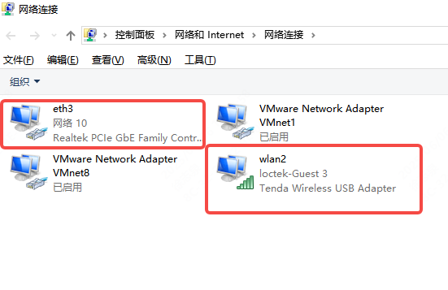
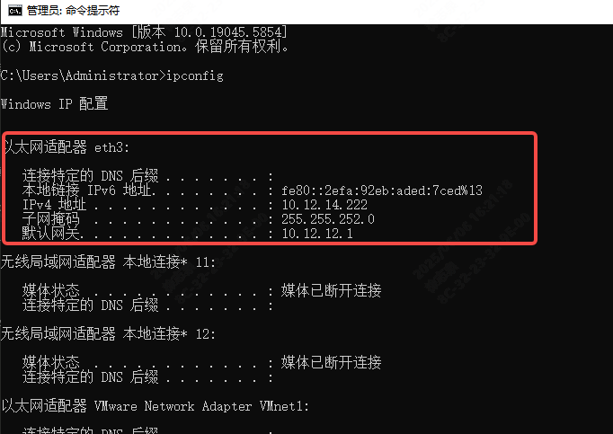
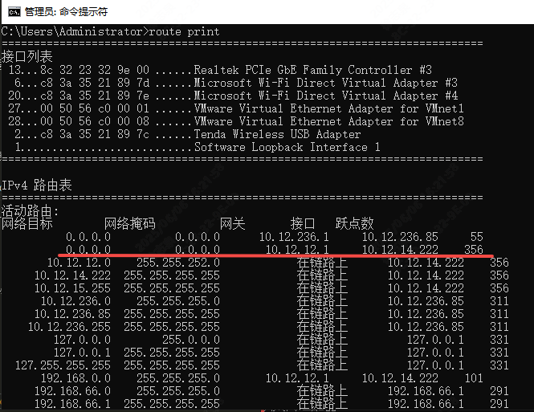
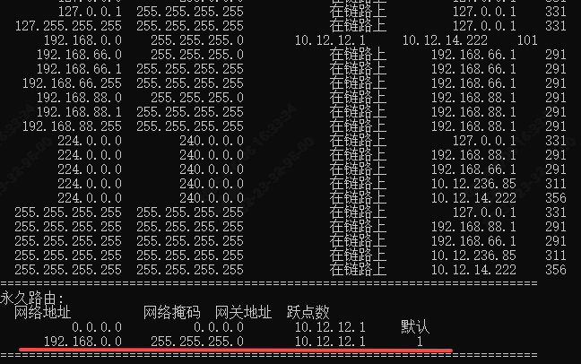

# 0612——win设置路由表实现内网外网同时访问

## 需求起源

由于公司的有限网络只连接内网，无法访问外网。但在做软件开发时，要查阅很多资料，必然需要上外网。

其他同事的解决办法是，使用自己的笔记本电脑访问外网，我选择给公司电脑外置了一个USB网卡。

这样就有两个网卡了，一个网卡（eth3）有线连接内网，一个网卡（wlan2）USB无线连接外网，剩下是虚拟机网卡

但是双网卡存在一个问题。即同时启用时，所有网络请求只被一个网卡响应（根据网卡优先级，route print可以查看）

这就导致了，如果想访问公司内网的git仓库，只能启用内网网卡，想访问外网时又要启用外网网卡，这样来回切网卡很麻烦，我需要一个解决办法，让两个网卡同时启用时，内外网也可以同时访问。

## 解决方法

通过查阅双网卡访问内网外网的资料，了解到可以通过设置路由表，让不同的ip地址请求被不同的网关响应。那么只需要设置内网gitlab仓库的ip地址被内网网关响应就行了。

### 1确定需要被特定响应的ip地址，以及响应的指定网关地址

内网gitlab地址一般都是明显的。例如我现在公司内网的gitlab地址是`192.168.0.135`

内网网卡的网关地址。可以通过`ipconfig`查看网卡的默认网关，也可以通过`route print`查看路由表得知

### 2通过添加路由表，让该类ip地址被指定网关响应

添加内网IP走内网网关

`route add 192.168.0.0 mask 255.255.255.0 10.12.12.1`

其中mask 255.255.255.0 (0xff.0xff.0xff.0x00) 即为子网掩码，即取 192.168.0.0 & ff.ff.ff.0。

代表 192.168.0.x 一类ip地址，都被10.12.12.1响应。添加后通过route print查看

### 3举一反三

通过设置路由表，可以让自己想要的ip地址被指定网关响应。

因为设置网关地址是固定的，因此指定网卡的网关地址也最好是固定的，否则设置会失效

### 参考资料

[电脑无线网wifi和有线网同时使用（内网+外网同时使用）](https://blog.csdn.net/weixin_40837318/article/details/134125797?fromshare=blogdetail&sharetype=blogdetail&sharerId=134125797&sharerefer=PC&sharesource=Trans4mer&sharefrom=from_link)