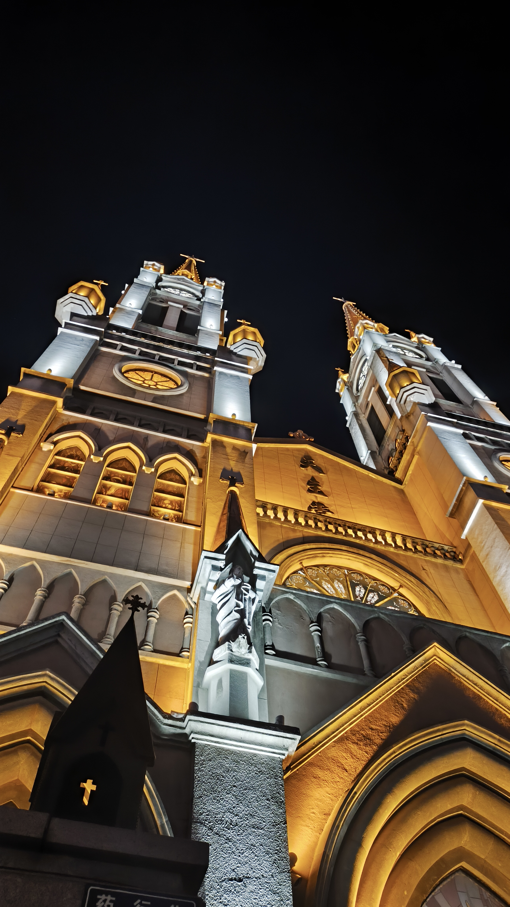

# 0705——时隔两年，故地重游—初来宁波找工作的路线

## 2023年5月14日回忆

由于2022年考研失败，现实告诉我必须踏上工作的道路，那么当时的我也尽力去做。当时还在台州，我想应该从本专业去入手工作，以我在学校学习到的一些技能，慢慢摸爬滚打。但是台州的电子产业显然是相比宁波、杭州要弱上不少的。工作机会也呈现正相关。在投递了多份宁波、杭州岗位后。有些眉目，但还没收到合适offer，我心想应当先去实地考察下，租房价格物价什么的，因为在网上参考了些信息，我想大概会先从宁波开始考察，因为租房成本和生活成本等等，对囊中羞涩的我来说比较重要。于是就有了14、15两天的初到宁波考察。

其实这两天的记忆，除了些许细节，大部分我还能清晰回忆起来。14日早晨，大概是七八点我就从校外租房出发了，DXY还在睡。由于去宁波的动车线是在台州西站的，在黄岩区，不在台州站即椒江市中，所以我要早些坐公交去台州西站。早起只是在超市简单买了一包豆浆一包优酸乳，至于为什么，不清楚当时是不是没胃口还是啥。但我忘记了 喝优酸乳后+我容易晕公交，结果可想而知，这并不是一个好的开始，但生活还得继续。

回想当时去宁波的目的，大概是想寻找价格合适能接受的住所，以便于我和dxy离开台州了，也能在留着宁波直至找到工作为止。但现在回想起来，还是太稚嫩了，如果不是在6月份运气好接到offer。这样的做法对经济拮据的我来说风险很大，又或者说当时就是抱着破釜沉舟的心态，找不到且花光钱就回老家种田了。

宁波站到站后，因为此行目的不明确，旨在熟悉宁波城市面貌，城市开销状况。我先是定好了一个位于丽园南站的便宜宾馆。随后就从宁波站开始步行探索了，我的确是很喜欢探索新鲜的。大致路线是（步行：宁波站-月湖景区-城隍庙麦当劳午餐）（地铁：城隍庙-芦岗-外滩大桥-滑板场）其中去芦岗是因为提前在网上看的一个住所可以实地看房，我便去了，剩余的路线都是我自己随心浏览的，现在看来我还是挺会挑中心区域的hhh，以上的路线都是我在14号完成的，虽然也没得到些什么好的信息，但是感觉宁波整体环境好，路面干净宽敞，交通也算得上方便。

除了自己定的老城区50块破宾馆体验很差，房间小气味臭，小蟑螂拍不完，以至于我是用不脱衣服，外套戴帽子裹着自己睡觉的，当然这没睡着hhh。所以第二天我大概五点就出门了，精神状态很不好（可能因为这个，我又将不满带回台州，带给的dxy，我很内疚）。15号早上吃了两次豆浆油条后，也是漫无目的的闲逛（无业游民是这样的），同时在手机上不停查看有没有合适住房，想尽可能利用时间看房，当然不是谁都像我这么闲且想一出是一出，得提前约时间看。走着走着，走了很长的路，脚也实在受不了了，我在月湖公园停了下来，是一个小亭子，还是很漂亮的，只是当时的精神状态不太好，而且比较迷茫，欣赏的心情没那么足，短暂滞留后，我就开始了回台州的行程。

## 故地重游，是另一番心境

趁着感想还新鲜，我记录下这篇日志。由于8号线在租房门口2025/6/30开通，我趁热去体验，从鄞州公园南，到宁波火车站，大概是花了二十多分钟还不错。我便开始了这趟重游旅程，当然不像当时特种兵一般，用了半天跑遍了半个宁波。我只做了最初始的一条路线，即（步行：宁波站-月湖景区-城隍庙）。这是我初来宁波的第一印象。

宁波站出站，我到了和两年前同样出站的地方（宁波火车站F口），马路交汇大人行道（南站西路和马园路交汇）处记忆犹新。也是一样的步行路线，沿着马园路一路向北到柳汀街，在沿柳汀街一路向东，到达月湖公园。月湖湖其实并不大，通过卫星地图可以很清楚看到主要建筑物就是两宅一中学了。然而对月湖印象最深的还是院士林。2023年来的时候就是沿着柳汀街一路到院士林。通过它才了解到宁波是中国出院士最多城市，可见教育文化，底蕴之深之重视。这也是我对宁波的第一印象，重教育，讲文化。还有个超级中学（镇海中学）。

当然，还有一处小地方同样令我印象深刻，便是袁宅向东，杨宅向南所在一处的小湖，边上的小亭院。2023年5月15日，也就是经过一14日晚上没睡好后，清晨离开旅馆，一路从丽园南路走到了月湖这里，并且歇脚调整，也是离开宁波前最后的停留地。以下是附图

这一次我依然在这里停留，并且是另一番心境和体会，我突然想到，今天的我会给两年前坐在这里迷茫、惆怅的xzq以什么样的建议呢？也就有了本篇的最后小结。

在这里稍作思考和停留后，我就前往最后一站城隍庙，这里没什么可说的，和旁边的天一广场我愿称为宁波的顶流，也是宁波我最推荐的地方之一（月湖、城隍庙、鼓楼、老外滩）这些地方都处于宁波核心地区三江口。而且相互接邻很方便，来宁波必去噢。城隍庙在2025是翻新过了的，所以对比2023要更有意思些，DXY在2023的5月二十几号和我一起来过这里，只可惜匆匆忙忙没有带她一起游历，只记得她在这里吃过瘦肉丸和上过城隍庙的老卫生间，我印象当时这里的卫生状况很糟糕，现在的新卫生间焕然一新，只可惜她已离开我。出于回忆，我去了当时DXY一起去过的瘦肉丸店，店还开着，不过再进去也不会有DXY了，我想去它对面的嵊州小吃点小笼包。

最后附上天一广场教堂，现在的天一地标很多，比如巨大的华为店，苹果宁波店，Jordan宁波店，还有三楼的二次元聚集地等。

## 给2023迷茫惆怅的xzq以建议——三条，两主一次

1. 找到擅长的事情，并且不断发展为自己的事业。（通常情况也是热爱的事情，但是也存在冲突的情况。首先要是擅长的事情。以Michael Jordan举例，他本人是擅长打篮球，且很喜欢打棒球的，但他曾说过，棒球让他体会到了作为普通人的感受。所以当冲突时，作为普通人没什么家庭背景，我倾向于先让擅长的事以物质滋养自己，再去做热爱的事，就算没有成就也没关系，就是个保底选项的问题。当然家里有矿怎么选都可以）

`（下1同上1并列的重要性，不过当时的xzq身体状况应该不错，所以是这么个顺序）`

1. 身体是革命的本钱，不断关注，维护自己的身体状况。（做什么事情，首要条件是让自己处于良好的身体条件，如果没有这个条件，那么什么事情都做不成的，可能我在公交车上晕车都挺不过去了，更别说半天走了半个宁波，所以一定善待好自己的身体。这里也是说给现在的我听的，最近发现虎牙的磨损越来越严重了，应该是晚上磨牙造成的，再不关注30岁就没牙齿用咯hhhh）

2. 维护好那些能滋养你，给予你能量的人际关系。（人是社会关系的总和，如果在原始森林一个人独居，那也无法定义自己的了，最多算个动物。叔本华作为悲观主义哲学的代表人物，在他看来：“人的生存就是一场痛苦的斗争，生命的每一秒钟都在为抵抗死亡而斗争，而这是一场注定要失败的斗争”。在我看来，如果能有良好的人际关系，可以稍微减轻你在世界上的痛苦与孤独，不论是在网络上志同道合的同志，还是现实生活中支持鼓励你的人，这些都是痛苦人生中的微光。是可以支持你走下去的力量。）

    只可惜由于许多原因，两年前支撑我一人来宁波打拼的力量——DXY，已经离我而去。但我想又化为另一种力量，支持我不断走下去，虽然她以不再见我，但我仍倔强相信，在有生的某一天，我可以再见到她。遗憾至此，告诫自己一定要维护好那些重要的人际关系。