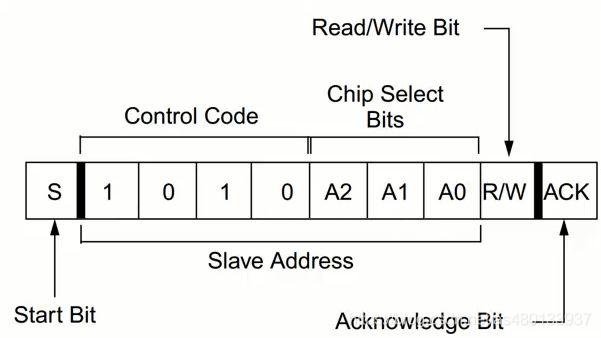

!!! note "分层设计架构"

    - APL 应用层 (Application Layer)

        项目硬件资源之上的代码，例如 scheduler任务调度器，UI交互逻辑等。

    - FML 设备模块层 (Function Module Layer)

        是对一系列HDL操作的再封装，例如该模块某业务功能，是由一系列硬件驱动动作序列组成的。
        假设定义一个AT24C02(EEPROM)上电数据准确性自检的业务动作（读取数据并比较差异再保存）。
        需要AT24CXX_Read(),AT24CXX_Write(),等动作序列组成AT24CXX_Check()的业务动作。
        将这些HDL层的操作序列封装，就是设备模块层

    - HDL/BSP 硬件驱动层 (Hardware Module Layer)

        是对一系列HAL操作的再封装，例如AT24C02(EEPROM)需要一系列IIC动作序列驱动，ST7789(TFT-LCD)需要一系列SPI动作序列驱动。 
        AT24C02(EEPROM)实现读一个字节的操作，是由若干条IIC动作序列 IIC_Start()，IIC_Send_Byte()，IIC_Wait_Ack()，IIC_Stop() 组成了AT24CXX_ReadOneByte()
        将这些动作封装起来，成为具体设备的固定基本操作，就是硬件驱动层
    
    - HAL 硬件抽象层（Hardware Abstract Layer）

        由厂家提供，是对硬件寄存器操作的封装层。
        MCU的内核资源 Systick、NVIC / 片上资源 GPIO、UART、FLASH、ADC等等

    大道至简，越简单的代码，越不容易犯错，越容易纠错。逻辑清晰的软件架构可以节省开发时间，节省调试时间，以及减少程序的bug。

## 1 APL (Application Layer)

### KeyScan 按键扫描 

- 少量IO检测多个按键实现

    1.使用矩阵按键，例如行4列4，8个IO组成的矩阵可以检测4*4=16个按键，但少量按键这个方法不合适

    2.使用ADC检测多个按键，通过电阻分压，使得不同按键电压值不同。

- 软件消抖

    1.定时器延时检测状态。不消耗CPU资源，裸机可用

    2.延时死等检测状态。消耗CPU资源，裸机不可用，RTOS下可用

#### keyscan.c

结构体面向对象+有限状态机 实现多个按键扫描

```c
#define KEY_NUM             2 // 按键实例总数量
/////////////////// 按键引脚读取函数 ///////////////////
uint8_t key_up_readpin(void){
    return GPIO_ReadInputDataBit(GPIOA, GPIO_Pin_7);
}
uint8_t key_down_readpin(void){
    return GPIO_ReadInputDataBit(GPIOA, GPIO_Pin_4);
}
/////////////////// 按键状态机实例 ///////////////////
KeyFsm key_up = {
    .fsm_state = KEY_STATE_IDLE,
    .last_fsm_state = KEY_STATE_IDLE,
    .event = KEY_EVENT_NONE,
    .last_state = KEY_RELEASED,
    .press_time = 0,
    .detect_time = 0,
    .debounce_time = 20,     // 默认消抖时间20ms
    .long_press_time = 1000,  // 默认长按判定时间1000ms
    .read_pin = &key_up_readpin
};
KeyFsm key_down = {
    .fsm_state = KEY_STATE_IDLE,
    .last_fsm_state = KEY_STATE_IDLE,
    .event = KEY_EVENT_NONE,
    .last_state = KEY_RELEASED,
    .press_time = 0,
    .detect_time = 0,
    .debounce_time = 20,     // 默认消抖时间20ms
    .long_press_time = 1000,  // 默认长按判定时间1000ms
    .read_pin = &key_down_readpin
};
/////////////////// 按键实例集合 ///////////////////
KeyFsm* key_array[KEY_NUM] = {&key_up, &key_down};

/**
* @brief 初始化按键扫描
* 
* @param key_fsm 初始化目标（按键状态机实例），结构体指针形式
* @param read_pin_func 赋给目标的读取引脚状态函数，函数指针形式
*/
void key_scan_init(KeyFsm* key_fsm, uint8_t (*read_pin_func)(void)) {
    if (read_pin_func) {
        key_fsm->read_pin = read_pin_func;
    }
    
    key_fsm->fsm_state = KEY_STATE_IDLE;
    key_fsm->last_fsm_state = KEY_STATE_IDLE;
    key_fsm->event = KEY_EVENT_NONE;
    key_fsm->last_state = KEY_RELEASED;
}

/**
* @brief 获取当前按键事件
* 
* @param key_fsm 被读取按键事件的目标（按键状态机实例），结构体指针形式
* @return KeyEvent 返回的按键事件
*/
KeyEvent key_scan_get_event(KeyFsm* key_fsm) {
    KeyEvent event = key_fsm->event;
    key_fsm->event = KEY_EVENT_NONE;  // 读取后清除事件
    return event;
}

/**
* @brief 按键状态机处理函数
* 
* @param key_fsm 被处理的目标（按键状态机实例），结构体指针形式
* @param current_state 传入的目标（按键状态机实例）当前按键状态
*/
static void key_fsm_process(KeyFsm* key_fsm, uint8_t current_state) {

    uint32_t current_time = timer_get_ms();  // 获取当前时间(ms)
    
    switch (key_fsm->fsm_state) {
        case KEY_STATE_IDLE:
            // 检测到按键按下(假设0为按下状态)
            if (current_state == KEY_PRESSED && key_fsm->last_state == KEY_RELEASED) {
                key_fsm->fsm_state = KEY_STATE_PRESS_DETECT;
                key_fsm->detect_time = current_time;
            }
            break;
            
        case KEY_STATE_PRESS_DETECT:
            // 消抖检测: 保持按下状态超过消抖时间
            if (current_state == KEY_PRESSED) {
                if (current_time - key_fsm->detect_time >= key_fsm->debounce_time) {
                    key_fsm->fsm_state = KEY_STATE_PRESSED;
                    key_fsm->press_time = current_time;
                }
            } 
            else {
                // 未通过消抖，回到空闲状态
                key_fsm->fsm_state = KEY_STATE_IDLE;
            }
            break;
            
        case KEY_STATE_PRESSED:
            // 按键释放
            if (current_state == KEY_RELEASED) {
                key_fsm->last_fsm_state = KEY_STATE_PRESSED;
                key_fsm->fsm_state = KEY_STATE_RELEASE_DETECT;
                key_fsm->detect_time = current_time;
            }
            // 检测长按
            else if (current_time - key_fsm->press_time >= key_fsm->long_press_time) {
                key_fsm->fsm_state = KEY_STATE_LONG_PRESS;
                key_fsm->event = KEY_EVENT_LONG_PRESS;
            }
            break;
            
        case KEY_STATE_LONG_PRESS:
            // 长按状态下释放按键
            if (current_state == KEY_RELEASED) {
                key_fsm->last_fsm_state =KEY_STATE_LONG_PRESS;
                key_fsm->fsm_state = KEY_STATE_RELEASE_DETECT;
                key_fsm->detect_time = current_time;
            }
            break;
            
        case KEY_STATE_RELEASE_DETECT:
            // 消抖检测: 保持释放状态超过消抖时间
            if (current_state == KEY_RELEASED) {
                if (current_time - key_fsm->detect_time >= key_fsm->debounce_time) {                    
                    // 根据之前的状态判断是短按还是长按后释放
                    if (key_fsm->last_fsm_state == KEY_STATE_PRESSED) {
                        key_fsm->event = KEY_EVENT_SHORT_PRESS;
                    }
                    key_fsm->fsm_state = KEY_STATE_IDLE;
                    key_fsm->last_fsm_state = KEY_STATE_IDLE;
                }
            } 
            else {
                // 未通过消抖，回到按下状态
                key_fsm->fsm_state = (key_fsm->fsm_state == KEY_STATE_LONG_PRESS) ? 
                                        KEY_STATE_LONG_PRESS : KEY_STATE_PRESSED;
            }
            break;
            
        default:
            key_fsm->fsm_state = KEY_STATE_IDLE;
            break;
    }
    
    key_fsm->last_state = (KeyState)current_state;
}

/**
* @brief 按键扫描函数，应定期调用(建议10ms一次)
* 
*/
void key_scan(void) {
    
    uint8_t i = 0;
    uint8_t current_state;

    // 遍历所有按键实例集合
    for (i = 0; i < KEY_NUM; i++)
    {
        if (key_array[i]->read_pin == NULL) {
            return;
        }
        
        // 读取当前按键状态
        current_state = key_array[i]->read_pin();
        
        // 处理状态机
        key_fsm_process(key_array[i], current_state);
    }
    
}
```

#### keyscan.h

```c
#ifndef __KEYSCAN_H__
#define __KEYSCAN_H__

// 按键按下状态枚举
typedef enum {
    KEY_PRESSED,          // 按下 0
    KEY_RELEASED         // 释放 1
} KeyState;

// 按键状态枚举
typedef enum {
    KEY_STATE_IDLE,          // 空闲状态
    KEY_STATE_PRESS_DETECT,  // 检测到按下，消抖中
    KEY_STATE_PRESSED,       // 已按下状态
    KEY_STATE_LONG_PRESS,    // 长按状态
    KEY_STATE_RELEASE_DETECT // 检测到释放，消抖中
} KeyFsmState;

// 按键事件枚举
typedef enum {
    KEY_EVENT_NONE,          // 无事件
    KEY_EVENT_SHORT_PRESS,   // 短按事件
    KEY_EVENT_LONG_PRESS     // 长按事件
} KeyEvent;

// 按键状态机结构体
typedef struct {
    KeyFsmState fsm_state;          // 状态机当前状态
    KeyFsmState last_fsm_state;     // 上一次状态机状态，用于判定按键事件
    KeyEvent event;          // 当前事件
    KeyState last_state;// 上一次读取的按键状态
    uint32_t press_time;     // 按下时间戳
    uint32_t detect_time;    // 检测开始时间戳
    uint16_t debounce_time;  // 消抖时间(ms)
    uint16_t long_press_time;// 长按判定时间(ms)
    uint8_t (*read_pin)(void);// 读取按键引脚状态的函数指针
} KeyFsm;

extern KeyFsm key_up;
extern KeyFsm key_down;

// 初始化按键扫描
void key_scan_init(KeyFsm* key_fsm, uint8_t (*read_pin_func)(void));
// 获取当前按键事件
KeyEvent key_scan_get_event(KeyFsm* key_fsm);
// 按键扫描函数，应定期调用
void key_scan(void);

#endif

```

### Menu 多级菜单 

使用结构体定义菜单类，并且使用结构体指针跳转菜单层级

#### menu.c

```c

#define ARR_LEN(ARR)        (sizeof(ARR)/sizeof((ARR)[0]))

typedef struct{
    //当前菜单索引
    uint8_t menu_idx;
    //菜单名称
    uint8_t menu_name[20];
    //菜单函数指针
    void (*func)(void);
}menu;

//首页菜单
menu home_page[] = 
{
    {//短信菜单
        .menu_idx = 0,
        .menu_name = "message",
        .func = &message_func
    },
    {//电话菜单
        .menu_idx = 1,
        .menu_name = "call",
        .func = &call_func
    },
    {//设置菜单
        .menu_idx = 2,
        .menu_name = "setting",
        .func = &setting_func
    }
};

//设置菜单——子菜单
menu setting_page[] = 
{
    {//时间设置
        .menu_idx = 0,
        .menu_name = "time_setting",
        .func = &time_setting_func
    },
    {//音量设置
        .menu_idx = 1,
        .menu_name = "volume_setting",
        .func = &volume_setting_func
    },
    {//亮度设置
        .menu_idx = 2,
        .menu_name = "brightness_setting",
        .func = &brightness_setting_func
    }
};

//菜单指针
menu *menu_ptr = NULL;

menu_ptr = &home_page[0];//初始化为首页菜单

void setting_func(void)
{
    menu_ptr = &setting_page[0];//跳转到设置菜单
    show_menu(menu_ptr, ARR_LEN(setting_page));
}

```

### Scheduler 时间轮转调度器 

#### scheduler.c

### Queue 循环队列 

队列在计算机系统中的应用非常广泛，以下仅从两个方面来阐述

1. 解决主机与外部设备速度不匹配的问题

    以主机和打印机之间的速度不匹配的问题为例做简要说明。主机输出数据给打印机打印，输出的数据比打印机的数据要快很多
    ，因为速度不匹配，若直接把输出的数据送给打印机，显然是不行的。解决的方法是设置一个打印数据缓冲区，主要把打印输出的数据
    依次写入这个缓冲区，写满后就暂停输出，转去做其他事情。打印机就从缓冲区中按照先进先出的原则依次取出数据并且打印，打印完成当前数据再向主机请求数据。这样既保证了打印数据的正确，又使主机提高了效率————王道数据结构

    - 例：需要MCU在某时刻产生多条带有当前状态的信息，但UART发送数据受波特率限制，无法短时间内发送完毕，若不缓存，时变原因状态改变。那么先将当前产生的数据入队，串口发送完一包数据后，查看循环队列是否空，非空则数据出队，并且由UART发送。避免丢失当前产生的数据包，并且保持数据包时间关系的一致

    - 例：UART接受到了很多数据包，处理数据包需要耗时，但如果不缓存数据包，那么时间推移导致数据覆盖，丢包。此时可以开设一个队列，对每一个接受完成的数据包进行入队，数据入队后进行解析并且出队，避免错失接受的数据包，并且保持数据包时间关系的一致

2. 解决由多用户引起的资源竞争问题

    CPU（即中央处理器，它包括运算器和控制器）资源的竞争就是一个典型例子。在一个带有多终端的计算机系统上，有多个用户需要CPU各自运行自己的程序，他们分别通过各自的终端向操作系统提出占用CPU请求。操作系统通常按照每个请求的时间先后顺序，把他们排成队列，每次CPU分配给队首请求的用户使用。当前的程序运行结束或用完规定的时间间隔后，令其出队，再把CPU分配给队首请求的用户使用。满足每个用户的请求。

#### queue.c

```c
/**
* @brief 循环队列入队操作
* @param Q 循环队列首结点地址
* @param x 入队元素
*/
bool EnQueue(SqQueue &Q,ElemType x){
    if((Q.rear+1)%MAXSIZE==Q.front)
        return false;

    Q.data[Q.rear]=x;
    Q.rear=(Q.rear+1)%MAXSIZE;
    return true;
}

/**
* @brief 循环队列出队操作
* @param Q 循环队列首结点地址
* @param x 出队元素迁移变量
*/
bool DeQueue(SqQueue &Q,ElemType &x){
    if(Q.rear==Q.front)
        return false;

    x=Q.data[Q.front];
    Q.front=(Q.front+1)%MAXSIZE;
    return true;
}
```

### InAppProgram 应用升级 

!!! note 

    IAP (In Application Program) / OTA (Over The Air)

    Bootloader（引导程序）+FlashArea1（APP1应用程序段）+FlashArea2（APP2应用程序备份段）

    为了防止IAP升级失败，应该有刷新回滚功能，即备份段（若MCU的FLASH空间足够）

    主要在于Bootloader的程序编写，次要在于APP程序中断向量表偏移，以及Boot与APP间的跳转

- Bootloader：用通信来接收APP的bin文件，可以写入片内Flash，或SRAM直接跳转。接收完成后应当校验程序是否完整，才能进行跳转

    ```c
    //STM32中的简易的BOOT跳转APP

    //确定app程序区首地址 
    #define FLASH_APP1_ADDR		0x08002000 

    typedef  void (*iapfun)(void);//定义一个函数类型的参数.

    iapfun jump2app; 

    //设置堆栈地址
    __asm void MSR_MSP(u32 addr) 
    {
        MSR MSP, r0 			//set Main Stack value
        BX r14
    }

    //跳转到应用程序段
    //appxaddr:用户代码起始地址.
    void iap_load_app(u32 appxaddr)
    {
        if(((*(vu32*)appxaddr)&0x2FFE0000)==0x20000000)	//检查栈顶地址是否合法.
        {
            jump2app=(iapfun)*(vu32*)(appxaddr+4);		//用户代码区第二个字为程序开始地址(复位地址)		
            MSR_MSP(*(vu32*)appxaddr);					//初始化APP堆栈指针(用户代码区的第一个字用于存放栈顶地址)
            jump2app();									//跳转到APP.
        }
    }

    int main(void)
    {   
        SystemInit();//系统时钟初始化

        if(((*(vu32*)(FLASH_APP1_ADDR+4))&0xFF000000)==0x08000000)//判断是否为0X08XXXXXX.
        {	 
            iap_load_app(FLASH_APP1_ADDR);//执行FLASH APP代码
        }
    }
    ```

- APP：由于Boot程序已经占用了Flash的一些空间，所以需要根据占用来偏移APP程序的所在空间。另外需要重新定位中断向量表，使得APP程序里中断可以正常运行

    ```c
    #define APP_START_ADDRESS	(uint32_t)(0x08002000)

    SCB->VTOR = APP_START_ADDRESS; /* Vector Table Relocation in Internal FLASH. */  
    ```

    需要注意的是 Cortex-M0 的中断向量表重定位，因为M0架构没有重定位寄存器，使用无法使用`SCB->VTOR`来重新定位中断向量表。
    常规的做法是，RAM中腾处一些固定空间，专门存放复制的中断向量表。然后重新定向到RAM地址（通常0x20000000）

    [STM32 Cortex-M0单片机中断向量表重映射](https://blog.taats.cn/archives/171.html)


## 2 HAL（Hardware Abstract Layer）

[stm32f10x reference manual](https://www.st.com/resource/en/reference_manual/rm0008-stm32f101xx-stm32f102xx-stm32f103xx-stm32f105xx-and-stm32f107xx-advanced-armbased-32bit-mcus-stmicroelectronics.pdf)


### SysTick 滴答定时器

```c
// 1 滴答定时器配置 SysTick_Config
// 以72MHZ时钟频率举例，1秒计72M次。
// 72M / 1000 = 72000，也就是计数72000次产生一次中断
// 时间上就是1ms，1秒中断1000次
SysTick_Config(SystemCoreClock / 1000);//SystemCoreClock 为MCU主频 .

// 2 滴答中断处理函数 SysTick_Handler
void SysTick_Handler()//滴答中断处理函数
```

### RCC 复位和时钟控制

!!! note "RCC（Reset and Clock Control）"

    RCC是STM32微控制器中的一个重要模块.
    
    用于管理系统的时钟和复位功能。RCC 模块负责为各个外设提供时钟信号，并控制这些时钟信号的通断

### GPIO 通用输入输出

!!! note "General Purpose Input Output"

    1） GPIO_Mode_AIN 模拟输入；ADC

    2） GPIO_Mode_IN_FLOATING 浮空输入；按键

    3） GPIO_Mode_IPD 下拉输入；默认低电平，检测上升沿

    4） GPIO_Mode_IPU 上拉输入；默认高电平，检测下升沿

    5） GPIO_Mode_Out_OD 开漏输出；

    6） GPIO_Mode_Out_PP 推挽输出；输出高低电平，是最常用的模式。

    7） GPIO_Mode_AF_OD 复用开漏输出；IIC

    8） GPIO_Mode_AF_PP 复用推挽输出。UART, SPI

[GPIO八种工作模式讲解，图文结合，一文带你轻松搞懂 - 知乎](https://zhuanlan.zhihu.com/p/661515170)

### EXIT 外部中断 / INT中断

### TIM 定时器

### ADC 模拟/数字转换器

### DMA 直接内存访问

### IWDG 独立看门狗

### FLASH 片内存储

Flash latency（闪存延迟）指的是从 CPU 或控制器发出读取 / 写入请求，到 Flash 存储器完成操作并返回数据 / 确认的时间间隔，本质是衡量 Flash 响应速度的核心指标。

它的产生核心源于 Flash 的物理特性：Flash 存储单元的擦除、编程操作需通过电荷迁移实现，无法像 SRAM 那样即时响应，因此存在固有延迟。通常分为两类：

1. 读取延迟（Read Latency）：最受关注的类型，即 CPU 请求读取某地址数据后，等待数据返回的时间，直接影响程序执行效率（尤其 MCU 从 Flash 运行代码时）。
2. 写入 / 擦除延迟（Program/Erase Latency）：执行数据写入或区块擦除操作的耗时，通常远长于读取延迟（例如擦除一个 Flash 扇区可能需要毫秒级，而读取仅需几十纳秒）。
   
FLASH的速度是有限的，有时并不能与核心频率一样，按手册要求，当主频为24MHz或以下时，可以将LATENCY设置为0，48MHz时设置为 1，主频72MHz 需要插入2个等待，将速度降到72/3=24Mhz。否则有可能取指不稳定。意思就是不管HCLK有多高，取指令的速度最高为24Mhz。如果程序中单周期指令占绝大多数，简单核心中没有cache，即使使用流水线，实际指令运行速度也就是24M。

### UART 通信协议

!!! note "Universal Asynchronous Receiver / Transmitter 通用异步收发器"

    这可能是MCU嵌入式领域最重要的通信方式了。在开发调试中，最常见最简便的通信方式。

    通信速率：常见 115200 , 19200 , 9600 bps

    全双工：双数据线，RX接收，TX发送，故为全双工（收发同时进行）

    异步：无同步时钟线CLK，故为异步信号，数据传输不稳定、不可靠。

- UART通信协议时序解析

    起始位：标志数据帧开始，接收端通过检测下降沿触发同步。

    数据位：常用8位，最低位在前LSB，最高位在后MSB。

    奇偶校验位：可选项，一般不加

    校验类型|规则|特点
    ---|---|---
    无校验|不添加校验位|节省1bit时间，无检错能力
    奇校验|使得数据位+校验位中1的总数为奇数|检测单比特错误
    偶校验|使得数据位+校验位中1的总数为偶数|检测单比特错误
    Mark|固定为1|作为第9位数据使用
    Space|固定为0|作为第9位数据使用

    停止位：高电平，标志帧结束，并为下一帧提供缓冲时间。

    常规包：1位起始位 + 8位数据位 + 1位停止位。故传输1byte = 8bit data需要10bit，在9600波特率下，10bit大概花费1ms的传输时间

    

    [UART Protocol Overview TI Precision Labs](https://www.ti.com/content/dam/videos/external-videos/en-us/9/3816841626001/6313217959112.mp4/subassets/uart_protocol_overview_and_error_sources_0.pdf)

    [UART通信协议详解](https://blog.csdn.net/linxiaosongXXDDDGS/article/details/147543367)

!!! tip "硬件UART配置——四步两函数"

    四步
    1 配置IO，TX（AF_PP）推免输出，RX（IPU）上拉输入
    2 配置NVIC串口中断管理
    3 配置UART参数
    4 配置DMA

    两函数
    1 中断处理函数，UART_IRQHandler()
    2 串口发送函数，可以重定向fputc(),使用 printf()

!!! tip "UART通信断包方式"

    ​1 根据数据帧的帧头帧尾进行断包（软件实现）

    定义数据包的帧头，帧尾，以及数据长度，校验码 
    ASCII码数据包：可以使用0x0D 0x0A（'\r\n'）断包，不会产生重复
    HEX码数据包：无法使用0x0D 0x0A断包，因为可能会有相同的hex数据

    2 根据数据字节间，接收间隔计时断包（软件实现）

    使用时间断包，不用像帧头帧尾断包一样，需要考虑包含帧头尾数据的情况
    UART传输都是使用标准波特率，因此UART传输一帧数据时，字与字之间的时间间隔是一个固定值
    可以根据UART的波特率去计算串口每个字符的间隔时间
    例如在数据接收的过程中判断当字符间隔大于3.5个（modbus协议常用），则认为当前数据帧传输完毕

    3 配置串口帧空闲中断（硬件实现）

    串口IDLE中断，串口接收完完整的一帧数据自身产生的中断，配置使能该中断后，
    串口会判断总线上一个字节的时间间隔内，有没有再次接收到数据，
    如果没有则当前一帧数据接收完成，产生IDLE中断。

参考：[串口接收完整一帧数据包的3种方法_串口接收一帧数据及解析](https://blog.csdn.net/meilante5190/article/details/106959764)

#### uart.c

```c
uart_par_str uart_par[UART_NUM];

void UART1_GPIO_Init(void)
{
    GPIO_InitTypeDef GPIO_InitStruct;
    RCC_AHBPeriphClockCmd(RCC_AHBENR_GPIOA, ENABLE);

    GPIO_PinAFConfig(GPIOA, GPIO_PinSource3, GPIO_AF_1);
    GPIO_PinAFConfig(GPIOA, GPIO_PinSource12, GPIO_AF_1);
    //UART1_TX   GPIOA.12
    GPIO_StructInit(&GPIO_InitStruct);
    GPIO_InitStruct.GPIO_Pin = GPIO_Pin_12;
    GPIO_InitStruct.GPIO_Speed = GPIO_Speed_50MHz;
    GPIO_InitStruct.GPIO_Mode = GPIO_Mode_AF_PP;
    GPIO_Init(GPIOA, &GPIO_InitStruct);
    //UART1_RX    GPIOA.3
    GPIO_InitStruct.GPIO_Pin = GPIO_Pin_3;
    GPIO_InitStruct.GPIO_Mode = GPIO_Mode_IPU;
    GPIO_Init(GPIOA, &GPIO_InitStruct);
}

void UART1_Config(u32 baudrate)
{
    NVIC_InitTypeDef NVIC_InitStruct;
    UART_InitTypeDef UART_InitStruct;

    UART1_GPIO_Init();
    //enable UART1,GPIOA clock
    RCC_APB1PeriphClockCmd(RCC_APB1ENR_UART1, ENABLE);
    //baud rate
    UART_StructInit(&UART_InitStruct);
    UART_InitStruct.BaudRate = baudrate;
    //The word length is in 8-bit data format.
    UART_InitStruct.WordLength = UART_WordLength_8b;
    UART_InitStruct.StopBits = UART_StopBits_1;
    //No even check bit.
    UART_InitStruct.Parity = UART_Parity_No;
    //No hardware data flow control.
    UART_InitStruct.HWFlowControl = UART_HWFlowControl_None;
    UART_InitStruct.Mode = UART_Mode_Rx | UART_Mode_Tx;
    UART_Init(UART1, &UART_InitStruct);
    //clear itflg
    UART_ClearITPendingBit(UART1,(UART_OVER_ERR|UART_IER_RX));
    //uart ITConfig
    UART_ITConfig(UART1, (UART_OVER_ERR|UART_IER_RX), ENABLE);
    //NVIC config
    NVIC_InitStruct.NVIC_IRQChannel = UART1_IRQn;
    NVIC_InitStruct.NVIC_IRQChannelPriority = 0x01;
    NVIC_InitStruct.NVIC_IRQChannelCmd = ENABLE;
    NVIC_Init(&NVIC_InitStruct);
    //uart enable
    UART_Cmd(UART1, ENABLE);
}

/**
 * @brief 开启串口发送
 * @param uart_idx 串口序列号
*/
void UART_StartTX(u8 uart_idx)
{
    switch(uart_idx)
    {
        case UART_IDX_1:
            UART_ITConfig(UART1, UART_IER_TX, ENABLE);
        break;

        case UART_IDX_2:
            UART_ITConfig(UART2, UART_IER_TX, ENABLE);
        break;

        ....

        default:
        break;
    }
}
/**
 * @brief 停止串口发送
 * @param uart_idx 串口序列号
*/
void UART_StopTX(u8 uart_idx)
{
    switch(uart_idx)
    {
        case UART_IDX_1:
            UART_ITConfig(UART1, UART_IER_TX, DISABLE);
        break;

        case UART_IDX_2:
            UART_ITConfig(UART2, UART_IER_TX, DISABLE);
        break;

        ....

        default:
        break;
    }
}
/**
 * @brief 串口发送1个Byte
 * @param uart_idx 串口序列号
*/
void UART_SendByte(u8 data, u8 uart_idx)
{
    switch(uart_idx)
    {
        case UART_IDX_1:
            UART1->TDR = data;
        break;

        case UART_IDX_2:
            UART2->TDR = data;
        break;

        ....

        default:
        break;
    }
}
/**
 * @brief 串口接收监测，请1ms执行一次
*/
void uart_timeout_1ms(void)
{
    u8 i = 0;
    for (; i < UART_NUM; i++)
    {
        if(READ_BIT(uart_par[i].uart_flag, FLAG_UART_RECVING))
        {
            uart_par[i].recv_timeout++;
            //5ms没有再收到数据，表示超时
            if (uart_par[i].recv_timeout > 5)
            {
                lostpack_count++;
                CLEAR_BIT(uart_par[i].uart_flag, FLAG_UART_RECVING);
            }
        }
    }
}
/**
 * @brief 串口发数据缓存
 * @param length 数据缓存长度
 * @param uart_idx 串口序列号
*/
void uart_send_buf(u8 length, u8 uart_idx)
{
    SET_BIT(uart_par[uart_idx].uart_flag, FLAG_UART_SENDING);
    uart_par[uart_idx].send_index = 1;
    uart_par[uart_idx].send_length = length;
    UART_SendByte(uart_par[uart_idx].send_buf[0], uart_idx);
    UART_StartTX(uart_idx);
    //uart_par[uart_idx].send_index = 0;
    //uart_par[uart_idx].send_length = length;
    //UART_StartTX(uart_idx);
}
/**
 * @brief 串口发送事件，在串口发送中断中调用
 * @param uart_idx 串口序列号
*/
void uart_send_event(u8 uart_idx)
{
    if (uart_par[uart_idx].send_index < uart_par[uart_idx].send_length)
    {
        UART_SendByte(uart_par[uart_idx].send_buf[uart_par[uart_idx].send_index], uart_idx);
        uart_par[uart_idx].send_index++;
    }
    else
    {
        CLEAR_BIT(uart_par[uart_idx].uart_flag, FLAG_UART_SENDING);
        UART_StopTX(uart_idx);
    }
}
/**
 * @brief 串口接收事件，在串口中断中调用
 * @param RX_Data 收到的Byte
 * @param uart_idx 串口序列号
*/
void uart_recv_event(u8 RX_Data, u8 uart_idx)
{
    switch(uart_idx)
    {
        case UART_IDX_1:
            // IDLE空闲状态，不论如何，进入接收状态
            if (0 == READ_BIT(uart_par[uart_idx].uart_flag, FLAG_UART_RECVING))
            {
                uart_par[uart_idx].recv_index = 0;
                uart_par[uart_idx].recv_buf[uart_par[uart_idx].recv_index++] = RX_Data;
                SET_BIT(uart_par[uart_idx].uart_flag, FLAG_UART_RECVING);
            }
            //进入了接收状态，检查帧尾 0X0D 0X0A
            else
            {
                // 接收到0X0A，并且前一个字节是0X0D，则分包，接收完成
                if((0x0A == RX_Data) && (0x0D == uart_par[uart_idx].recv_buf[uart_par[uart_idx].recv_index - 1]))
                {
                    //判断数据长度，过滤起始0X0D 0X0A
                    if(uart_par[uart_idx].recv_index >= 2)
                        SET_BIT(uart_par[uart_idx].uart_flag, FLAG_FRAME_OK);
                    else
                        CLEAR_BIT(uart_par[uart_idx].uart_flag, FLAG_UART_RECVING);
                }
                else
                {
                    // 不是帧尾，接收数据
                    uart_par[uart_idx].recv_buf[uart_par[uart_idx].recv_index++] = RX_Data;
                    //接收报文超过缓冲区长度，重新接收
                    if (uart_par[uart_idx].recv_index >= RECV_BUF_MAX_SIZE)
                    {
                        CLEAR_BIT(uart_par[uart_idx].uart_flag, FLAG_UART_RECVING);
                    }
                }
            }
        break;

        case UART_IDX_2:
        break;
        
        default:
        break;
    }
    //清除超时计数
    uart_par[uart].recv_timeout = 0;
}
/**
 * @brief UART1中断处理函数
*/
void UART1_IRQHandler(void)
{
    u8 RX_Data;
    //send data
    if (UART_GetITStatus(UART1,UART_IT_TXIEN) != RESET)
    {
        if (UART1->IER & UART_IER_TX)
        {
            UART_ClearITPendingBit(UART1, UART_IT_TXIEN);
            uart_send_event(UART_IDX_1);
        }
    }
    //receive data
    if (UART_GetITStatus(UART1,UART_IT_RXIEN) != RESET)
    {
        RX_Data = UART_ReceiveData(UART1);
        uart_recv_event(RX_Data, UART_IDX_1);
        UART_ClearITPendingBit(UART1, UART_IT_RXIEN);
    }
    // else if (UART_GetITStatus(UART1,UART_OVER_ERR) != RESET)
    // {
    //     RX_Data = UART_ReceiveData(UART1);
    //     uart_recv_event(RX_Data, UART_IDX_1);
    //     UART_ClearITPendingBit(UART1, UART_OVER_ERR);
    // }
}
```

#### uart.h

```c
#ifndef __UART_H__
#define __UART_H__

#define UART_NUM                2           //串口总数量

#define UART_IDX_1              0           //对应串口1
#define UART_IDX_2              1           //对应串口2

#define FLAG_UART_SENDING       (1 << 0)    //串口发送标识
#define FLAG_UART_RECVING       (1 << 1)    //串口接收标识
#define FLAG_FRAME_OK            (1 << 7)   //串口帧完成标识

#define SEND_BUF_MAX_SIZE       50          //接收缓冲区最大长度
#define RECV_BUF_MAX_SIZE       50          //接收缓冲区最大长度

typedef struct
{
    u8 uart_flag;       //串口状态标志
    u8 recv_timeout;    //接收超时计数
    u8 recv_index;       //接收索引
    u8 send_index;      //发送索引
    u8 send_length;     //发送缓存长度
    u8 send_buf[SEND_BUF_MAX_SIZE];
    u8 recv_buf[RECV_BUF_MAX_SIZE];
}uart_par_str;

void uart_timeout_1ms(void);
void uart_send_buf(u8 length, u8 uart);
void uart_send_event(u8 uart);
void uart_recv_event(u8 RX_Data, u8 uart);

#endif
```

### IIC 通信协议

!!! note "Inter-Integrated Circuit"

    半双工：单数据线SDA，故为半双工（收发无法同时进行只能选其一）
    
    同步：有同步时钟线CLK，故为同步信号，数据传输稳定、可靠。

[IIC原理超详细讲解](https://blog.csdn.net/as480133937/article/details/105366932?ops_request_misc=%257B%2522request%255Fid%2522%253A%2522171578482616800184123274%2522%252C%2522scm%2522%253A%252220140713.130102334..%2522%257D&request_id=171578482616800184123274&biz_id=0&utm_medium=distribute.pc_search_result.none-task-blog-2~all~top_positive~default-1-105366932-null-null.142^v100^pc_search_result_base7&utm_term=IIC&spm=1018.2226.3001.4187)

[IIC的一些要点](https://blog.csdn.net/shaguahaha/article/details/70766665)

- <mark>三种判断信号：起始信号、停止信号、应答信号（应答与非应答）

- <mark>设备寻址：
  
    主机向从机发送起始信号后的第一个字节8bit是寻址数据，后面的字节都是数据，不再是寻址数据，除非又重新来一个起始信号。

    寻址数据8bit。高7bit是地址数据，剩下1bit用来表示传输方向，0写1读。写操作SDA设置输出、读操作SDA设置输入
    
    7bit即2^7 = 128，除去0x00可以寻址127个地址，说明IIC总线上最多挂载127个设备

    

- <mark>通信发起：

    从机不能主动发数据，是由主机带头来发送起始信号、停止信号、应答信号。

    SDA 设置输出则是发数据，设置输入则是收数据，需要有主机发出起始信号结束信号

- 通信应答：
  
    每当发送器传输完一个字节的数据之后，发送端会等待一定的时间，等接收方的应答信号。

    接收端通过拉低SDA数据线，给发送端发送一个应答信号，以提醒发送端我这边已经接受完成，数据可以继续传输，接下来，发送端就可以继续发送数据了。

### SPI 通信协议

!!! note "Serial Peripheral interface"

    全双工：双数据线，MOSI（Master Out Slave In），MISO（Master In Slave Out），故为全双工（收发同时进行）

    同步：有同步时钟线CLK，故为同步信号，数据传输稳定、可靠。

### CAN 通信协议

!!! note
    
    半双工：双数据线CANH，CANL，但为差分信号（相同信号），故为半双工（收发无法同时进行只能选其一）

    异步：无同步时钟线CLK，故为异步信号，差分信号，双绞线抗干扰，数据稳定、可靠。

### USB 通信协议

## 参考资料

1. [嵌入式软件分层框架设计，举了个例子 - 知乎](https://zhuanlan.zhihu.com/p/593242261)
2. [嵌入式软件架构设计-程序分层](https://www.cnblogs.com/const-zpc/p/16364443.html)
