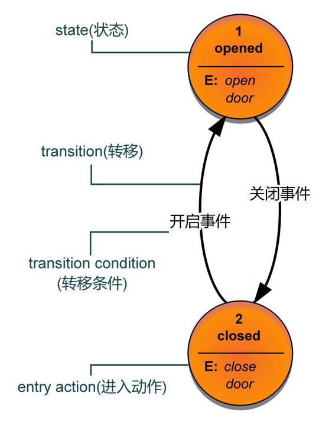

!!! note "状态机"

    状态机一般指有限状态机（finite-state machine，缩写：FSM）又称有限状态自动机（finite-state automaton，缩写：FSA），是表示有限个状态以及在这些状态之间的转移和动作等行为的数学计算模型。
    
    状态机概念： state(状态) 、transition(转移) 、action(动作) 、transition condition(转移条件) 

## 1 状态机概念

- State 状态。一个状态机至少要包含两个状态。例如自动门，有 open 和 closed 两个状态。

- Event 事件。事件就是执行某个操作的触发条件或者口令。对于自动门，“按下开门按钮”就是一个事件。

- Action 动作。事件发生以后要执行动作。例如事件是“按开门按钮”，动作是“开门”。编程的时候，一个 Action一般就对应一个函数。

- Transition 变换。也就是从一个状态变化为另一个状态。例如“开门过程”就是一个变换。



## 2 状态图

[freertos任务状态](https://www.freertos.org/zh-cn-cmn-s/Documentation/02-Kernel/02-Kernel-features/01-Tasks-and-co-routines/02-Task-states)


## 3状态机实例

- 让任意IO口成为UART-TX的魔法：TIM定时器中断+经典状态机：

    使用中断模拟通讯时序，但是中断间隔的us级别甚至ns级别的。那么时序数据需要提前准备好，而不是中断任务结束一次产生一次数据，这样会使得时序数据间隔太大。可以开设一个队列对需要模拟的时序数据入队，只需要进中断时处理并且出队即可。保持数据时序一致的同时，数据间隔最小，效率最高

```c
//8bit的数据，用于传输
uint8_t byte_data = 0xff;
//字节传输状态机枚举
typedef enum
{
    START = 0,      //起始位
    BYTE,           //字节
    VERIFY,         //校验
    STOP            //停止位
}uart_state_machine;

//若f(TIMx)= 1/9600，那么该IO模拟串口波特率为9600
//该定时器实现了传输一个8bit的变量byte_data
//如果想实现多byte的传输，可以开设一个存放byte的循环队列queue，不断入队enqueue出队dequeue即可。
void TIMx_IRQHandler(void)
{
    //static使变量只初始化一次，下次进入函数不初始化改变变量值，为上次退出函数的值。
    static uart_state_machine  state = START;//状态机起始状态
    static u8 bit_cnt,odd_verify;//字节计数、奇偶校验位

    if (TIM_GetITStatus(TIMx, TIM_IT_Update) != RESET)
    {
        //清除定时器中断标志位
        TIM_ClearITPendingBit(TIMx, TIM_IT_Update);

        //模拟UAT传输8bit数据
        switch (status)
        {
            //起始位，产生一个下降沿
            case START:
                IO_H();   
                IO_L();
                status = BYTE;//完成动作，状态转换
                break;

            //数据位，低位bit在前LSB，高位bit在后MSB
            case BYTE:
                if(byte_data & 0x01)
                {
                    IO_H();
                    odd_verify++;
                }
                else
                {
                    IO_L();
                }
                byte_data >>= 1;

                if(bit_cnt >= 7)
                    status = VERIFY;//完成动作，状态转换
                else
                    bit_cnt++;
                
                break;

            //校验位，可选项，此处举例奇校验
            case VERIFY:
                //data有偶数个1，不满足奇校验，故verify需要为1，data+verify的1才能为奇数个	
                if(0 == odd_verify%2)		         
                {
                    IO_H();
                }
                //data有奇数个1，已满足奇校验，故verify不需要为1，置为0
                else			        
                {
                    IO_L();
                }
                
                status = STOP;//完成动作，状态转换
                break;

            //停止位，置为高电平即可
            case STOP:
                IO_H();
                status = START;//完成动作，状态转换
                bit_cnt = 0;
                odd_verify = 0;
                break;

            default:
                break;
        }
    }
}
```

## 参考资料

1. [什么是状态机？一篇文章就够了](https://blog.csdn.net/m0_61703043/article/details/125853828)
2. [状态机的介绍与使用](https://www.cnblogs.com/lori/p/18632376)
