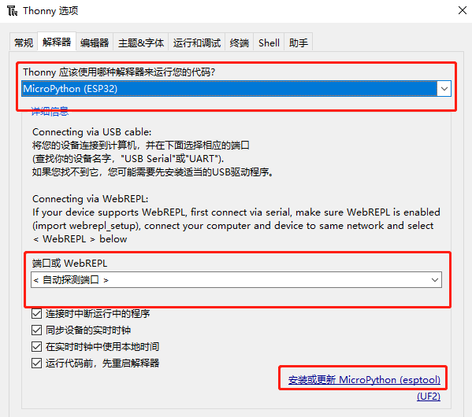

Soc (System on chip)

IC芯片：CPU + 特定功能模块(TPU等)

## Espressif 32Bit Soc

    内核：Tensilica 的Xtensa 内核的双核构架

    ESP32-C3：160MHZ，2.4GHz WIFI，低功耗蓝牙
    ESP32-S3：240MHZ，2.4GHz WIFI，低功耗蓝牙，USB 串口/JTAG 控制器
    ESP32-C6：160MHZ，2.4GHz WIFI，低功耗蓝牙，支持 Thread 和 Zigbee 协议

### MicroPython开发（快速）

将Micropython固件烧入ESP32，即可开始使用MicroPython开发 [micropython](http://micropython.com.cn/en/latet/index-2.html)

1. 下载Thonny，下载固件（如果是源地买的就用源地固件）[github-vccgnd](https://github.com/vcc-gnd)

2. Thonny选项配置解释器，并且烧录固件



注意：重启后自动启动main.py，测试代码不要写在main，否则错误重启死循环​

#### 添加软件包：工具->管理包

- machine 硬件

    SPI(id, baudrate, polarity, phase, bits, firstbit, sck, mosi, miso)

    id请查看datasheet分组

    注意：sck，mosi，miso都需要定义，否则报错

- usocket 套接字

    [mpython -usocket](https://mpython.readthedocs.io/zh/master/library/pythonStd/usocket.html)

- requests HTTP请求

    使用requests进行HTTP爬虫

- zlib 二进制流解压/压缩库

    暂时只有解压功能

### ESP32 SDK开发（性能）

VScode + ESP-IDF extension [ESP-IDF编程指南](https://docs.espressif.com/projects/esp-idf/zh_CN/latest/esp32/index.html)

#### ESP-IDF ToolChain

1. ESP-IDF Offline Installer 

    [Windows 平台工具链的标准设置 ](https://docs.espressif.com/projects/esp-idf/zh_CN/latest/esp32s3/get-started/windows-setup.html)

    [vscode+espidf开发环境搭建(实现单步调试)](https://blog.csdn.net/weixin_43842462/article/details/123295842)

2. VScode ESP-IDF extension (not recommend)

    不建议，此方法无openOCD驱动，则无法打开openOCD，需要自己配置

    [ESP32-C3 JTAG调试笔记](https://www.cnblogs.com/jianzhan/p/ESP32-C3-JTAG.html)

工具链安装好就可以使用 VScode IDF extension，如果找不到开发板串口，请检查USB驱动

#### Debug with VScode

[JTAG 调试](https://docs.espressif.com/projects/esp-idf/zh_CN/latest/esp32/api-guides/jtag-debugging/index.html)

[vscode+espidf开发环境搭建(实现单步调试)](https://blog.csdn.net/weixin_43842462/article/details/123295842)

VScode调试：选择通过USB-JTAG即可打开openOCD，配置launch.json，即可调试。

如果打开调试失败/出问题，请尝试重启openOCD

```json
    //修改launch.json为
    {
    "version": "0.2.0",
    "configurations": [
        {
        "name": "GDB",
        "type": "cppdbg",
        "request": "launch",
        "MIMode": "gdb",
        "miDebuggerPath": "${command:espIdf.getXtensaGdb}",
        "program": "${workspaceFolder}/build/${command:espIdf.getProjectName}.elf",
        "windows": {
            "program": "${workspaceFolder}\\build\\${command:espIdf.getProjectName}.elf"
        },
        "cwd": "${workspaceFolder}",
        "environment": [{ "name": "PATH", "value": "${config:idf.customExtraPaths}" }],
        "setupCommands": [
            { "text": "target remote :3333" },
            { "text": "set remote hardware-watchpoint-limit 2"},
            { "text": "mon reset halt" },
            { "text": "thb app_main" },
            { "text": "flushregs" }
        ],
        "externalConsole": false,
        "logging": {
            "engineLogging": true
        }
        }
    ]
    }
```