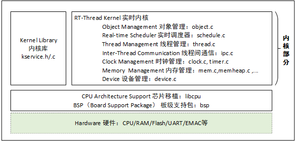

!!! abstract "RTThread"

    - RT-Thread 是一款完全由国内团队开发维护的嵌入式实时操作系统（Real-time operating system, RTOS），具有完全的自主知识产权。

    RT-Thread 主要采用 C 语言编写，浅显易懂，方便移植。它把面向对象的设计方法应用到实时系统设计中，使得代码风格优雅（类Linux）、架构清晰、系统模块化并且可裁剪性非常好。

    针对资源受限的微控制器（MCU）系统，可通过方便易用的工具，裁剪出仅需要 3KB Flash、1.2KB RAM 内存资源的 NANO 版本（NANO 是 RT-Thread 官方于 2017 年 7 月份发布的一个极简版内核）。
    
    而对于资源丰富的物联网设备，RT-Thread 又能使用在线的软件包管理工具，配合系统配置工具实现直观快速的模块化裁剪，无缝地导入丰富的软件功能包，实现类似 Android 的图形界面及触摸滑动效果、智能语音交互等复杂功能。

[RT-Thread org](https://www.rt-thread.org/)

## C面向对象的系统设计思想

RT-Thread 中各类内核对象的派生和继承关系。

对于每一种具体内核对象和对象控制块，除了基本结构外，还有自己的扩展属性（私有属性）。

例如，对于线程控制块，在基类对象基础上进行扩展，增加了线程状态、优先级等属性。这些属性在基类对象的操作中不会用到，只有在与具体线程相关的操作中才会使用。

因此从面向对象的观点，可以认为每一种具体对象是抽象对象的派生，继承了基本对象的属性并在此基础上扩展了与自己相关的属性。


```c
//内核对象控制块结构体
struct rt_object{    
​      /* 内核对象名称     */   
​      char      name[RT_NAME_MAX]; 
​     /* 内核对象类型     */
​     rt_uint8_t  type;
​     /* 内核对象的参数   */
​     rt_uint8_t  flag;
​     /* 内核对象管理链表 */
​     rt_list_t   list;
​};

//内核对象容器的数据结构
struct rt_object_information{
​     /* 对象类型 */
​     enum rt_object_class_type type;
​     /* 对象链表 */
​     rt_list_t object_list;
​     /* 对象大小 */
​     rt_size_t object_size;
​};
```

这种设计方法的优点有：

（1）提高了系统的可重用性和扩展性，增加新的对象类别很容易，只需要继承通用对象的属性再加少量扩展即可。

（2）提供统一的对象操作方式，简化了各种具体对象的操作，提高了系统的可靠性。

## 一、内核及应用



### 1.1 内核启动流程

RT-Thread 支持多种平台和多种编译器，而 rtthread_startup() 函数是 RT-Thread 规定的统一启动入口。一般执行顺序是：系统先从启动文件开始运行，然后进入 RT-Thread 的启动函数 rtthread_startup() ，最后进入用户入口函数 main()


```
为了在进入 main() 之前完成 RT-Thread 系统功能初始化，我们使用了 MDK 的扩展功能 $Sub$$ 和 $Super$$。
​可以给 main 添加 $Sub$$ 的前缀符号作为一个新功能函数 $Sub$$main，这个 $Sub$$main 可以先调用一些要补充在 main 之前的功能函数（这里添加 RT-Thread 系统启动，进行系统一系列初始化），再调用 $Super$$main 转到 main() 函数执行，这样可以让用户不用去管 main() 之前的系统初始化操作。
```

### 1.2 线程控制块：rt_thread

线程是操作系统中最小的调度单位。

<mark>RT-Thread线程调度算法是基于优先级的全抢占式多线程调度算法，即在系统中除了中断处理函数、调度器上锁部分的代码和禁止中断的代码是不可抢占的之外，系统的其他部分都是可以抢占的，包括线程调度器自身。相同优先级的线程间采用时间片的轮转调度算法进行调度，使每个线程运行相应时间；

线程栈：线程栈大小可以这样设定，对于资源相对较大的 MCU，可以适当设计较大的线程栈；也可以在初始时设置较大的栈，例如指定大小为 1K 或 2K 字节，然后在 FinSH 中用 list_thread 命令查看线程运行的过程中线程所使用的栈的大小，通过此命令，能够看到从线程启动运行时，到当前时刻点，线程使用的最大栈深度，而后加上适当的余量形成最终的线程栈大小，最后对栈空间大小加以修改。

优先级：支持 256 个线程优先级。0 优先级代表最高优先级，最低优先级留给空闲线程使用；对于 ARM Cortex-M 系列，普遍采用 32 个优先级。

#### 线程管理API

```C
//创建线程
rt_thread_create() 
调用这个函数时，系统会从动态堆内存中分配一个线程句柄以及按照参数中指定的栈大小从动态堆内存中分配相应的空间。
//删除线程
rt_thread_delete()
调用该函数后，线程对象将会被移出线程队列并且从内核对象管理器中删除，线程占用的堆栈空间也会被释放，收回的空间将重新用于其他的内存分配。

//初始化线程（静态方法） 
rt_thread_init() 
静态线程的线程句柄（或者说线程控制块指针）、线程栈由用户提供。静态线程是指线程控制块、线程运行栈一般都设置为全局变量，在编译时就被确定、被分配处理，内核不负责动态分配内存空间。
//脱离线程（静态方法）
rt_thread_detach() 

//启动线程
rt_thread_startup()

//控制线程
rt_thread_control()
```

#### 本节示例

```C
##define THREAD_PRIORITY         25
##define THREAD_STACK_SIZE       512
##define THREAD_TIMESLICE        5

static rt_thread_t tid1 = RT_NULL;

/* 线程 1 的入口函数 */
static void thread1_entry(void *parameter)
{
    rt_uint32_t count = 0;

    while (1)
    {
        /* 线程 1 采用低优先级运行，一直打印计数值 */
        rt_kprintf("thread1 count: %d\n", count ++);
        rt_thread_mdelay(500);
    }
}

/* 创建线程 1，名称是 thread1，入口是 thread1_entry*/
tid1 = rt_thread_create("thread1",
                        thread1_entry, RT_NULL,
                        THREAD_STACK_SIZE,
                        THREAD_PRIORITY, THREAD_TIMESLICE);

/* 如果获得线程控制块，启动这个线程 */
if (tid1 != RT_NULL)
    rt_thread_startup(tid1);

/* 导出到 msh 命令列表中 */
MSH_CMD_EXPORT(thread_sample, thread sample);
```

### 1.3 时钟控制块 rt_timer

时钟管理以时钟节拍为基础，时钟节拍 OS Tick 是 RT-Thread 操作系统中最小的时钟单位。

在STM32中 ，由滴答定时器实现时钟节拍

​RT-Thread 的定时器提供两类定时器机制：​第一类是单次触发定时器。第二类是周期触发定时器

#### 硬件定时器与软件定时器

硬件定时器是芯片本身提供的定时功能。一般是由外部晶振提供给芯片输入时钟，芯片向软件模块提供一组配置寄存器，接受控制输入，到达设定时间值后芯片中断控制器产生时钟中断。<mark>硬件定时器的精度一般很高，可以达到纳秒级别，并且是中断触发方式。当需要实现更短时间长度的系统定时时，例如 OS Tick 是 10ms，而程序需要实现 1ms 的定时或延时，这种时候操作系统定时器将不能够满足要求，只能通过读取系统某个硬件定时器的计数器或直接使用硬件定时器的方式。

- 软件定时器是由操作系统提供的一类系统接口，它构建在硬件定时器基础之上，使系统能够提供不受数目限制的定时器服务。

- RT-Thread 操作系统提供软件实现的定时器，以时钟节拍（OS Tick）的时间长度为单位，即定时数值必须是 OS Tick 的整数倍，例如一个 OS Tick 是 10ms，那么上层软件定时器只能是 10ms，20ms，100ms 等，而不能定时为 15ms。RT-Thread 的定时器也基于系统的节拍，提供了基于节拍整数倍的定时能力。

#### 时钟管理API

```C
//创建定时器
rt_timer_create()
调用该函数接口后，内核首先从动态内存堆中分配一个定时器控制块，然后对该控制块进行基本的初始化。
//删除定时器
rt_timer_delete()
调用这个函数接口后，系统会把这个定时器从 rt_timer_list 链表中删除，然后释放相应的定时器控制块占有的内存

//初始化定时器(静态方法)
rt_timer_init()
//脱离定时器(静态方法)
rt_timer_detach()
脱离定时器时，系统会把定时器对象从内核对象容器中脱离，但是定时器对象所占有的内存不会被释放

//启动定时器 
rt_timer_start()

//停止定时器 
rt_timer_stop()
```

#### 本节示例

```C
/* 定时器的控制块 */
static rt_timer_t timer1;
static int cnt = 0;

/* 定时器 1 超时函数 */
static void timeout1(void *parameter)
{
    rt_kprintf("periodic timer is timeout %d\n", cnt);

    /* 运行第 10 次，停止周期定时器 */
    if (cnt++>= 9)
    {
        rt_timer_stop(timer1);
        rt_kprintf("periodic timer was stopped! \n");
    }
}

/* 创建定时器 1  周期定时器 */
    timer1 = rt_timer_create("timer1", timeout1,
                             RT_NULL, 10,
                             RT_TIMER_FLAG_PERIODIC);

    /* 启动定时器 1 */
    if (timer1 != RT_NULL) rt_timer_start(timer1);
```

### 1.4 线程间同步（信号量）

线程通过对信号量、互斥量的获取与释放进行同步；

​互斥量采用优先级继承的方式解决了实时系统常见的优先级翻转问题。

线程通过对事件的发送与接收进行同步；

​事件集支持多事件的 “或触发” 和“与触发”，适合于线程等待多个事件的情况。

#### 信号量控制块 rt_semaphore

#### 信号量管理API

```c
//创建信号量
 rt_sem_t rt_sem_create(const char *name,
                        rt_uint32_t value,
                        rt_uint8_t flag);

//删除号量
rt_err_t rt_sem_delete(rt_sem_t sem);    

//初始化信号量（静态方法）
rt_err_t rt_sem_init(rt_sem_t       sem,
                    const char     *name,
                    rt_uint32_t    value,
                    rt_uint8_t     flag)

//脱离信号量（静态方法）
rt_err_t rt_sem_detach(rt_sem_t sem);

//获取信号量
rt_err_t rt_sem_take (rt_sem_t sem, rt_int32_t time);

//释放信号量
rt_err_t rt_sem_release(rt_sem_t sem);
```

#### 信号管理本节示例

```C
生产者消费者 例程
/*
生产者，给共享数组中存入数字。消费者，从共享数组中获取数字

定义信号量：
①Lock，只有一个LOCK资源，每次只有一个线程对共享数组存入或取走
②Empty，表识这个数组位资源为空位，可以存入
③Full，表识这个数组位资源为满位，可以取走

定义线程操作：
①生产者线程：获取一个空位，获取LOCK，存入数字，释放LOCK，释放一个满位
②消费者线程：获取一个满位，获取LOCK，取走数字，释放LOCK，释放一个空位
*/
/* 定义最大 5 个元素能够被产生 */
##define MAXSEM 5

/* 用于放置生产的整数数组 */
rt_uint32_t array[MAXSEM];

/* 指向生产者、消费者在 array 数组中的读写位置 */
static rt_uint32_t set, get;

/* 指向线程控制块的指针 */
static rt_thread_t producer_tid = RT_NULL;
static rt_thread_t consumer_tid = RT_NULL;

struct rt_semaphore sem_lock;
struct rt_semaphore sem_empty, sem_full;

/* 生产者线程入口 */
void producer_thread_entry(void *parameter)
{
    int cnt = 0;

    /* 运行 10 次 */
    while (cnt < 10)
    {
        /* 获取一个空位 */
        rt_sem_take(&sem_empty, RT_WAITING_FOREVER);

        /* 修改 array 内容，上锁 */
        rt_sem_take(&sem_lock, RT_WAITING_FOREVER);
        array[set % MAXSEM] = cnt + 1;
        rt_kprintf("the producer generates a number: %d\n", array[set % MAXSEM]);
        set++;
        rt_sem_release(&sem_lock);

        /* 发布一个满位 */
        rt_sem_release(&sem_full);
        cnt++;

        /* 暂停一段时间 */
        rt_thread_mdelay(20);
    }

    rt_kprintf("the producer exit!\n");
}

/* 消费者线程入口 */
void consumer_thread_entry(void *parameter)
{
    rt_uint32_t sum = 0;

    while (1)
    {
        /* 获取一个满位 */
        rt_sem_take(&sem_full, RT_WAITING_FOREVER);

        /* 临界区，上锁进行操作 */
        rt_sem_take(&sem_lock, RT_WAITING_FOREVER);
        sum += array[get % MAXSEM];
        rt_kprintf("the consumer[%d] get a number: %d\n", (get % MAXSEM), array[get % MAXSEM]);
        get++;
        rt_sem_release(&sem_lock);

        /* 释放一个空位 */
        rt_sem_release(&sem_empty);

        /* 生产者生产到 10 个数目，停止，消费者线程相应停止 */
        if (get == 10) break;

        /* 暂停一小会时间 */
        rt_thread_mdelay(50);
    }

    rt_kprintf("the consumer sum is: %d\n", sum);
    rt_kprintf("the consumer exit!\n");
}

int producer_consumer(void)
{
    set = 0;
    get = 0;

    /* 初始化 3 个信号量 */
    rt_sem_init(&sem_lock, "lock",     1,      RT_IPC_FLAG_PRIO);
    rt_sem_init(&sem_empty, "empty",   MAXSEM, RT_IPC_FLAG_PRIO);
    rt_sem_init(&sem_full, "full",     0,      RT_IPC_FLAG_PRIO);

    /* 创建生产者线程 */
    producer_tid = rt_thread_create("producer",
                                    producer_thread_entry, RT_NULL,
                                    THREAD_STACK_SIZE,
                                    THREAD_PRIORITY - 1,
                                    THREAD_TIMESLICE);
    if (producer_tid != RT_NULL)
    {
        rt_thread_startup(producer_tid);
    }
    else
    {
        rt_kprintf("create thread producer failed");
        return -1;
    }

    /* 创建消费者线程 */
    consumer_tid = rt_thread_create("consumer",
                                    consumer_thread_entry, RT_NULL,
                                    THREAD_STACK_SIZE,
                                    THREAD_PRIORITY + 1,
                                    THREAD_TIMESLICE);
    if (consumer_tid != RT_NULL)
    {
        rt_thread_startup(consumer_tid);
    }
    else
    {
        rt_kprintf("create thread consumer failed");
        return -1;
    }

    return 0;
}

/* 导出到 msh 命令列表中 */
MSH_CMD_EXPORT(producer_consumer, producer_consumer sample);
```

#### 互斥量控制块 rt_mutex

#### 互斥量管理API

```c
//创建互斥量
rt_mutex_t rt_mutex_create (const char* name, rt_uint8_t flag);
//删除互斥量
rt_err_t rt_mutex_delete (rt_mutex_t mutex); 

//初始化互斥量（静态方法）
rt_err_t rt_mutex_init (rt_mutex_t mutex, const char* name, rt_uint8_t flag);
//脱离互斥量（静态方法）
rt_err_t rt_mutex_detach (rt_mutex_t mutex);

//获取互斥量
rt_err_t rt_mutex_take (rt_mutex_t mutex, rt_int32_t time);

//释放互斥量
rt_err_t rt_mutex_release(rt_mutex_t mutex);
```

#### 事件集控制块 rt_event

它能够在一定程度上替代信号量，用于线程间同步。
但是它与信号量不同的是，事件的发送操作在事件未清除前，是不可累计的，而信号量的释放动作是累计的。

事件的另一个特性是，接收线程可等待多种事件，即多个事件对应一个线程或多个线程。

同时按照线程等待的参数，可选择是 “逻辑或” 触发还是 “逻辑与” 触发。这个特性也是信号量等所不具备的，信号量只能识别单一的释放动作，而不能同时等待多种类型的释放。

```c
//创建事件集
rt_event_t rt_event_create(const char* name, rt_uint8_t flag);
//删除事件集
rt_err_t rt_event_delete(rt_event_t event);

//初始化事件集（静态方法）
rt_err_t rt_event_init(rt_event_t event, const char* name, rt_uint8_t flag);
//脱离事件集（静态方法）
rt_err_t rt_event_detach(rt_event_t event);

///发送事件集
rt_err_t rt_event_send(rt_event_t event, rt_uint32_t set);

//接收事件集
rt_err_t rt_event_recv(rt_event_t event,
                           rt_uint32_t set,
                           rt_uint8_t option,
                           rt_int32_t timeout,
                           rt_uint32_t* recved);
```

### 1.5 线程间通信

RTThread 支持邮箱和消息队列等通信机制。

RTThread 邮箱中一封邮件的长度固定为 4 字节（32bit）

#### 邮箱控制块 rt_mailbox

邮箱能够用于不超过 4 字节的消息传递。由于在 32 系统上 4 字节的内容恰好可以放置一个指针，因此当需要在线程间传递比较大的消息时，可以把指向一个缓冲区的指针作为邮件发送到邮箱中，即邮箱也可以传递指针​

```c
//创建邮箱
rt_mailbox_t rt_mb_create (const char* name, rt_size_t size, rt_uint8_t flag);
//删除邮箱
rt_err_t rt_mb_delete (rt_mailbox_t mb);

//初始化邮箱（静态）
rt_err_t rt_mb_init(rt_mailbox_t mb,
                const char* name,
                void* msgpool,
                rt_size_t size,
                rt_uint8_t flag)
//脱离邮箱（静态）
rt_err_t rt_mb_detach(rt_mailbox_t mb);

//发送邮箱
rt_err_t rt_mb_send (rt_mailbox_t mb, rt_uint32_t value);

//接收邮箱
rt_err_t rt_mb_recv (rt_mailbox_t mb, rt_uint32_t* value, rt_int32_t timeout);
```

#### 消息控制块 rt_message

消息队列能够接收来自线程或中断服务例程中不固定长度的消息，并把消息缓存在自己的内存空间中。
其他线程也能够从消息队列中读取相应的消息，而当消息队列是空的时候，可以挂起读取线程。当有新的消息到达时，挂起的线程将被唤醒以接收并处理消息。

```c
//创建消息队列
rt_mq_t rt_mq_create(const char* name, rt_size_t msg_size,
            rt_size_t max_msgs, rt_uint8_t flag);
//删除消息队列
rt_err_t rt_mq_delete(rt_mq_t mq);

//初始化消息队列（静态）
rt_err_t rt_mq_init(rt_mq_t mq, const char* name,
                        void *msgpool, rt_size_t msg_size,
                        rt_size_t pool_size, rt_uint8_t flag);
//脱离消息队列（静态）
rt_err_t rt_mq_detach(rt_mq_t mq);

//发送消息
rt_err_t rt_mq_send (rt_mq_t mq, void* buffer, rt_size_t size);

//接收消息
rt_ssize_t rt_mq_recv (rt_mq_t mq, void* buffer,
                    rt_size_t size, rt_int32_t timeout);
```

#### 信号 signal

信号（又称为软中断信号），在软件层次上是对中断机制的一种模拟，在原理上，一个线程收到一个信号与处理器收到一个中断请求可以说是类似的

```c
//安装信号
rt_sighandler_t rt_signal_install(int signo, rt_sighandler_t[] handler);

//阻塞信号
void rt_signal_mask(int signo);

//解除阻塞
void rt_signal_unmask(int signo);

//发送信号
int rt_thread_kill(rt_thread_t tid, int sig);

//等待信号
int rt_signal_wait(const rt_sigset_t *set,
                        rt_siginfo_t[] *si, rt_int32_t timeout);
```

### 1.6 内存管理

#### 内存堆管理 rt_memheap

```c
//分配内存块
void *rt_malloc(rt_size_t nbytes);

//释放内存块
void rt_free (void *ptr);

//示例
int *pi;
pi = rt_malloc(100);
if(pi == NULL) 
{
    rt_kprintf("malloc failed\r\n");
}
```

- 小内存管理算法（针对小内存块的分配管理 ）

- slab 管理算法（针对大内存块的分配管理）

- memheap 管理算法（针对多内存堆的分配情况）

#### 内存池管理 rt_mempool

为了提高内存分配的效率，并且避免内存碎片。

RT-Thread 提供了另外一种内存管理方法：内存池（Memory Pool）。

内存池在创建时先向系统申请一大块内存，然后分成同样大小的多个小内存块，小内存块直接通过链表连接起来（此链表也称为空闲链表）。每次分配的时候，从空闲链表中取出链头上第一个内存块，提供给申请者。

```c
//创建内存池
rt_mp_t rt_mp_create(const char* name,
                         rt_size_t block_count,
                         rt_size_t block_size);
//删除内存池
rt_err_t rt_mp_delete(rt_mp_t mp);

//初始化内存池（静态）
rt_err_t rt_mp_init(rt_mp_t mp,
                        const char* name,
                        void *start, rt_size_t size,
                        rt_size_t block_size);
//脱离内存池（静态）
rt_err_t rt_mp_detach(rt_mp_t mp);

//分配内存池
void *rt_mp_alloc (rt_mp_t mp, rt_int32_t time);

//释放内存池
void rt_mp_free (void *block);
```

### 1.7 中断管理

## 二、设备和驱动

### 2.1 I/O 设备模型框架

RT-Thread 将 PIN、I2C、SPI、USB、UART 等作为外设设备，​统一通过设备注册完成。

实现了按名称访问的设备管理子系统，​可按照统一的 API 界面访问硬件设备


I/O 设备管理层实现了对设备驱动程序的封装。应用程序通过图中的"I/O设备管理层"提供的标准接口访问底层设备，设备驱动程序的升级、更替不会对上层应用产生影响。这种方式使得设备的硬件操作相关的代码能够独立于应用程序而存在，双方只需关注各自的功能实现，从而降低了代码的耦合性、复杂性，提高了系统的可靠性。
也提高应用层代码复用性，更换硬件时，对设备驱动作修改并且向上提供即可

### 2.2 创建和注册I/O设备

### 2.3 访问 I/O 设备

## 三、组件

### FinSH （RTThread shell）

早期不支持图形化时期，计算机先驱们开发了一种软件，它接受用户输入的命令，解释之后，传递给操作系统，并将操作系统执行的结果返回给用户。这个程序像一层外壳包裹在操作系统的外面，所以它被称为 shell。

## 参考资料