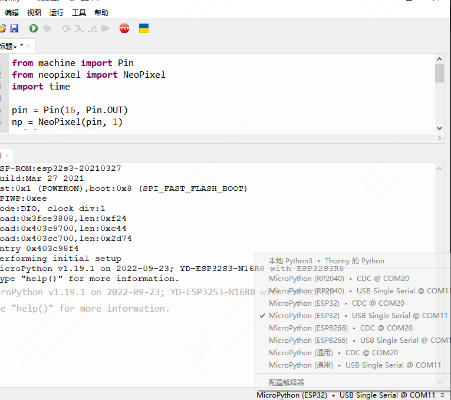
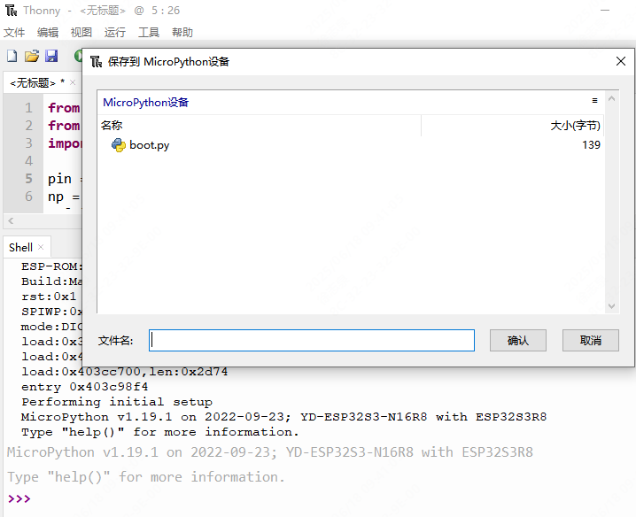

!!! abstract "SoC (System on Chip)"

    IC芯片：CPU + 特定功能模块(TPU等)

    本文的SoC指MCU-SoC，与手机SoC（通常为CortexA架构或更高性能）不同
    
    即低功耗，低性能，带无线通信的物联网MCU-SoC

## Espressif 32Bit SoC

    内核：Tensilica 的Xtensa 内核的双核构架

    ESP32-C3：160MHZ，2.4GHz WIFI，低功耗蓝牙
    ESP32-S3：240MHZ，2.4GHz WIFI，低功耗蓝牙，USB 串口/JTAG 控制器
    ESP32-C6：160MHZ，2.4GHz WIFI，低功耗蓝牙，支持 Thread 和 Zigbee 协议

### MicroPython开发（快速）

将Micropython固件烧入ESP32，即可开始使用 [micropython](http://micropython.com.cn/en/latet/index-2.html) 开发

1. 下载 Thonny编辑器、esp32-flash-download-tool（用于将固件写入板子）、 CH343驱动（识别串口）、源地micropython固件[github-vccgnd](https://github.com/vcc-gnd)

2. 板子写入固件后，即可使用thonny开发了，右下角选择对应的串口，并且选择esp32

    

3. 编写你的代码，保存到esp32，若存在boot.py，说明代码可以正常写入esp32。若无，请用flash-download-tool擦除flash再写入固件试试。

    

4. 保存为main.py，重启板子即正常运行

!!! warning

    重启后自动启动main.py，测试代码不要写在main，否则错误重启死循环​

#### 添加软件包：工具->管理包

- machine 硬件

    SPI(id, baudrate, polarity, phase, bits, firstbit, sck, mosi, miso)

    id请查看datasheet分组

    注意：sck，mosi，miso都需要定义，否则报错

- usocket 套接字

    [mpython -usocket](https://mpython.readthedocs.io/zh/master/library/pythonStd/usocket.html)

- requests HTTP请求

    使用requests进行HTTP爬虫

- zlib 二进制流解压/压缩库

    暂时只有解压功能

### ESP32 SDK开发（全面）

VScode + ESP-IDF extension [ESP-IDF编程指南](https://docs.espressif.com/projects/esp-idf/zh_CN/latest/esp32/index.html)

#### ESP-IDF ToolChain

1. ESP-IDF Offline Installer 

    [Windows 平台工具链的标准设置 ](https://docs.espressif.com/projects/esp-idf/zh_CN/latest/esp32s3/get-started/windows-setup.html)

    [vscode+espidf开发环境搭建(实现单步调试)](https://blog.csdn.net/weixin_43842462/article/details/123295842)

2. VScode ESP-IDF extension (not recommend)

    不建议，此方法无openOCD驱动，则无法打开openOCD，需要自己配置

    [ESP32-C3 JTAG调试笔记](https://www.cnblogs.com/jianzhan/p/ESP32-C3-JTAG.html)

工具链安装好就可以使用 VScode IDF extension，如果找不到开发板串口，请检查USB驱动

#### Debug with VScode

[JTAG 调试](https://docs.espressif.com/projects/esp-idf/zh_CN/latest/esp32/api-guides/jtag-debugging/index.html)

[vscode+espidf开发环境搭建(实现单步调试)](https://blog.csdn.net/weixin_43842462/article/details/123295842)

VScode调试：选择通过USB-JTAG即可打开openOCD，配置launch.json，即可调试。

如果打开调试失败/出问题，请尝试重启openOCD

```json
    //修改launch.json为
    {
    "version": "0.2.0",
    "configurations": [
        {
        "name": "GDB",
        "type": "cppdbg",
        "request": "launch",
        "MIMode": "gdb",
        "miDebuggerPath": "${command:espIdf.getXtensaGdb}",
        "program": "${workspaceFolder}/build/${command:espIdf.getProjectName}.elf",
        "windows": {
            "program": "${workspaceFolder}\\build\\${command:espIdf.getProjectName}.elf"
        },
        "cwd": "${workspaceFolder}",
        "environment": [{ "name": "PATH", "value": "${config:idf.customExtraPaths}" }],
        "setupCommands": [
            { "text": "target remote :3333" },
            { "text": "set remote hardware-watchpoint-limit 2"},
            { "text": "mon reset halt" },
            { "text": "thb app_main" },
            { "text": "flushregs" }
        ],
        "externalConsole": false,
        "logging": {
            "engineLogging": true
        }
        }
    ]
    }
```

## Telink BLE SoC

### TLSR825X

!!! tips "开发建议"
    
    TelinkSDK和AiThinkerSDK相互翻看，TelinkSDK为主，AiThinkerSDK为辅

    TelinkSDK是官方的，相比AiThinker这种代理商，代码更权威更完善。比如单连接SDK Demo，多连接SDK Demo都配有官方说明文档。能学得更深入。

    AiThinker是有AT固件的Demo，最开始用BLE都是AT指令开发的，比较熟悉，可以固件AT指令顺藤摸瓜熟悉功能。

#### TLSR825X——开发IDE

！！！注意：Telink IDE和Telink Studio是有区别的，TelinkIDE针对TLSR8（例如TLSR8258），而TelinkStudio针对TLSR9

[IDE for TLSR8 Chips](https://wiki.telink-semi.cn/wiki/IDE-and-Tools/IDE-for-TLSR8-Chips/)

[BDT Burning and Debugging Tools for all Series](https://wiki.telink-semi.cn/wiki/IDE-and-Tools/Burning-and-Debugging-Tools-for-all-Series/)

而TLSR8不像TLSR9支持调试，所以TLSR8只能用print打印来交互调试，故编写UART交互对于TLSR8开发是极为重要的。

下面TelinkSDK中，有对于UART交互部SDK开发的着重介绍。这是对TLSR8开发所必须的部分。

#### TLSR825X——Telink SDK

[泰凌软件文档 Mkdocs](https://doc.telink-semi.cn/doc/zh/software/)

[TLSR825x Series - Telink wiki](https://wiki.telink-semi.cn/wiki/chip-series/TLSR825x-Series/)

[多连接SDK 4.0.1.3 patch003](https://gitee.com/telink-semi/tc_ble_sdk/tree/V4.0.1.3_Patch_0003/)

！！！注意：Telink的文档更新速度并不快，例如多连接文档是对4.0.1.x的SDK说明，目前的4.0.2.x并不适用。所以github/gitee仓库应该选择早些的发行版（4.0.1.x）。

- 使用 4.0.1.x SDK开发UART DMA交互接口

    只需要引用b85m_ble_sdk / vendor / common / common_dbg.c即可 

    UART_LOW_POWER_DEBUG_EN 置为true即可调用low_power_uart_debug_init();

    ```c
    // 多连接SDK 4.0.1.3
    // tc_ble_sdk/ b85m_ble_sdk / vendor / common / common_dbg.c
    #if (UART_LOW_POWER_DEBUG_EN)
        // #if (MCU_CORE_TYPE == MCU_CORE_9518)
        // 	#define UART0_DMA_CHANNEL_TX            DMA4
        // 	#define UART0_BAUDRATE                  1000000  //115200

        // 	int lp_uart_init = 0;  //attention: can not be retention data !!!
        // 	void low_power_uart_debug_init(void)
        // 	{
        // 		uart0_init(UART0_BAUDRATE);
        // 		uart_set_tx_dma_config(UART0, UART0_DMA_CHANNEL_TX);
        // 		uart_clr_tx_done(UART0);
        // 		dma_clr_irq_mask(UART0_DMA_CHANNEL_TX,TC_MASK|ABT_MASK|ERR_MASK);

        // 		lp_uart_init = 1;
        // 	}
        #elif (MCU_CORE_TYPE == MCU_CORE_825x || MCU_CORE_TYPE == MCU_CORE_827x)
            #define UART_BAUDRATE					1000000
            #define UART_TRANS_BUFF_LEN				32

            __attribute__((aligned(4))) unsigned char uart_trans_buff[UART_TRANS_BUFF_LEN] = {0x0c,0x00,0x00,0x00,0x11,0x22,0x33,0x44,0x55,0x66,0x77,0x88,0x99,0xaa,0xbb,0xcc};

            int lp_uart_init = 0;  //attention: can not be retention data !!!
            void low_power_uart_debug_init(void)
            {
                reg_dma_uart_tx_size = UART_TRANS_BUFF_LEN >> 4;//set DMA TX buffer size.
                uart_gpio_set(UART_TX_PB1, UART_RX_PB7);// uart tx/rx pin set
                uart_reset();  //uart module power-on again.
                uart_init_baudrate(UART_BAUDRATE, CLOCK_SYS_CLOCK_HZ, PARITY_NONE, STOP_BIT_ONE);
                uart_dma_enable(0, 1); 	//uart data in hardware buffer moved by dma, so we need enable them first
                dma_chn_irq_enable(FLD_DMA_CHN_UART_TX, 1);   	//uart Tx dma irq enable

                lp_uart_init = 1;
            }
        #endif
    #endif
    ```

    但源文件中low_power_uart_debug_init(void)，并不满足我们的debug需求，稍作修改。。
    
    ```c
    void low_power_uart_debug_init(void)
    {
        reg_dma_uart_tx_size = UART_TRANS_BUFF_LEN >> 4;//set DMA TX buffer size.
        uart_gpio_set(UART_TX_PB1, UART_RX_PB7);// uart tx/rx pin set
        uart_reset();  //uart module power-on again.
        uart_init_baudrate(UART_BAUDRATE, CLOCK_SYS_CLOCK_HZ, PARITY_NONE, STOP_BIT_ONE);
        uart_dma_enable(0, 1); 	//uart data in hardware buffer moved by dma, so we need enable them first
        dma_chn_irq_enable(FLD_DMA_CHN_UART_TX, 1);   	//uart Tx dma irq enable

        lp_uart_init = 1;
    }
    ```

    再添加上uart_send、dma_receive_fifo、uart_dma_irq_handle，和receive_fifo解析函数，就满足了我们的debug需求

#### TLSR825X——AiThinker SDK

[TB 系列模组专题](https://docs.ai-thinker.com/blue_tooth/)

[Ai-Thinker-Open Telink_825X_SDK](https://github.com/Ai-Thinker-Open/Telink_825X_SDK)

！！！注意：请参考 README.MD 与 start_windows.MD，另外Aithinker的SDK很久没更新维护了，所以还是以TelinkSDK为主