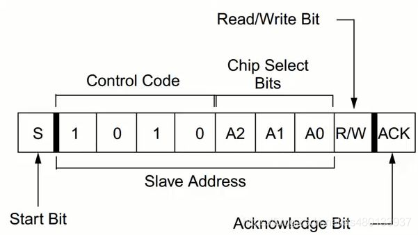
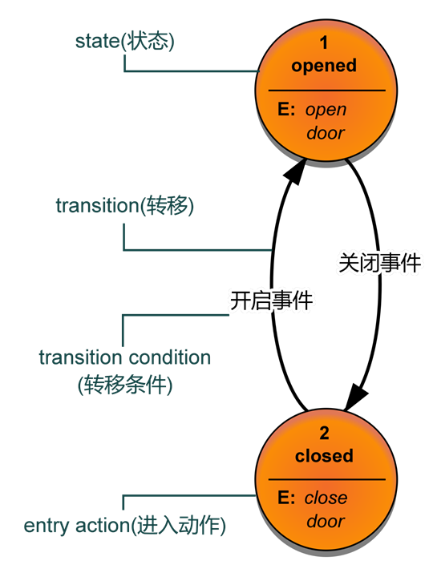

## 零、开发工具链

## 一、软件分层设计架构

!!! note

    - APL 应用层 (Application layer)

        项目硬件资源之上的代码，例如 scheduler任务调度器，UI交互逻辑等。

    - FML 设备模块层 (Function module layer)

        项目使用的模块驱动相关代码。

    - HDL 硬件驱动层 (Hardware module layer)

        MCU的内核资源 Systick、NVIC / 片上资源 GPIO、UART、FLASH、ADC等等
    
### APL (Application Layer)

#### 按键检测

- 少量IO检测多个按键实现

    1.使用矩阵按键，例如行4列4，8个IO组成的矩阵可以检测4*4=16个按键，但少量按键这个方法不合适

    2.使用ADC检测多个按键，通过电阻分压，使得不同按键电压值不同。

- 软件消抖

    1.定时器延时检测状态。不消耗CPU资源，裸机可用

    2.延时死等检测状态。消耗CPU资源，裸机不可用，RTOS下可用

#### 调度器 Scheduler

#### 多级菜单 Menu

使用结构体定义菜单类，并且使用结构体指针跳转菜单层级

```c

#define ARR_LEN(ARR)        (sizeof(ARR)/sizeof((ARR)[0]))

typedef struct{
    //当前菜单索引
    uint8_t menu_idx;
    //菜单名称
    uint8_t menu_name[20];
    //菜单函数指针
    void (*func)(void);
}menu;

//首页菜单
menu home_page[] = 
{
    {//短信菜单
        .menu_idx = 0,
        .menu_name = "message",
        .func = &message_func
    },
    {//电话菜单
        .menu_idx = 1,
        .menu_name = "call",
        .func = &call_func
    },
    {//设置菜单
        .menu_idx = 2,
        .menu_name = "setting",
        .func = &setting_func
    }
};

//设置菜单——子菜单
menu setting_page[] = 
{
    {//时间设置
        .menu_idx = 0,
        .menu_name = "time_setting",
        .func = &time_setting_func
    },
    {//音量设置
        .menu_idx = 1,
        .menu_name = "volume_setting",
        .func = &volume_setting_func
    },
    {//亮度设置
        .menu_idx = 2,
        .menu_name = "brightness_setting",
        .func = &brightness_setting_func
    }
};

//菜单指针
menu *menu_ptr = NULL;

menu_ptr = &home_page[0];//初始化为首页菜单

void setting_func(void)
{
    menu_ptr = &setting_page[0];//跳转到设置菜单
    show_menu(menu_ptr, ARR_LEN(setting_page));
}

```

#### 循环队列 Queue

队列在计算机系统中的应用非常广泛，以下仅从两个方面来阐述

1. 解决主机与外部设备速度不匹配的问题

    以主机和打印机之间的速度不匹配的问题为例做简要说明。主机输出数据给打印机打印，输出的数据比打印机的数据要快很多
    ，因为速度不匹配，若直接把输出的数据送给打印机，显然是不行的。解决的方法是设置一个打印数据缓冲区，主要把打印输出的数据
    依次写入这个缓冲区，写满后就暂停输出，转去做其他事情。打印机就从缓冲区中按照先进先出的原则依次取出数据并且打印，打印完成当前数据再向主机请求数据。这样既保证了打印数据的正确，又使主机提高了效率————王道数据结构

    - 例：需要MCU在某时刻产生多条带有当前状态的信息，但UART发送数据受波特率限制，无法短时间内发送完毕，若不缓存，时变原因状态改变。那么先将当前产生的数据入队，串口发送完一包数据后，查看循环队列是否空，非空则数据出队，并且由UART发送。避免丢失当前产生的数据包，并且保持数据包时间关系的一致

    - 例：UART接受到了很多数据包，处理数据包需要耗时，但如果不缓存数据包，那么时间推移导致数据覆盖，丢包。此时可以开设一个队列，对每一个接受完成的数据包进行入队，数据入队后进行解析并且出队，避免错失接受的数据包，并且保持数据包时间关系的一致

    - 例：使用中断模拟通讯时序，但是中断间隔的us级别甚至ns级别的。那么时序数据需要提前准备好，而不是中断任务结束一次产生一次数据，这样会使得时序数据间隔太大。可以开设一个队列对需要模拟的时序数据入队，只需要进中断时处理并且出队即可。保持数据时序一致的同时，数据间隔最小，效率最高

2. 解决由多用户引起的资源竞争问题

    CPU（即中央处理器，它包括运算器和控制器）资源的竞争就是一个典型例子。在一个带有多终端的计算机系统上，有多个用户需要CPU各自运行自己的程序，他们分别通过各自的终端向操作系统提出占用CPU请求。操作系统通常按照每个请求的时间先后顺序，把他们排成队列，每次CPU分配给队首请求的用户使用。当前的程序运行结束或用完规定的时间间隔后，令其出队，再把CPU分配给队首请求的用户使用。满足每个用户的请求。

#### 应用升级 IAP

!!! note 

    IAP (In Application Program) / OTA (Over The Air)

    Bootloader（引导程序）+FlashArea1（APP1应用程序段）+FlashArea2（APP2应用程序备份段）

    为了防止IAP升级失败，应该有刷新回滚功能，即备份段（若MCU的FLASH空间足够）

    主要在于Bootloader的程序编写，次要在于APP程序中断向量表偏移，以及Boot与APP间的跳转

- Bootloader：用通信来接收APP的bin文件，可以写入片内Flash，或SRAM直接跳转。接收完成后应当校验程序是否完整，才能进行跳转

    ```c
    //STM32中的简易的BOOT跳转APP

    //确定app程序区首地址 
    #define FLASH_APP1_ADDR		0x08002000 

    typedef  void (*iapfun)(void);//定义一个函数类型的参数.

    iapfun jump2app; 

    //设置堆栈地址
    __asm void MSR_MSP(u32 addr) 
    {
        MSR MSP, r0 			//set Main Stack value
        BX r14
    }

    //跳转到应用程序段
    //appxaddr:用户代码起始地址.
    void iap_load_app(u32 appxaddr)
    {
        if(((*(vu32*)appxaddr)&0x2FFE0000)==0x20000000)	//检查栈顶地址是否合法.
        {
            jump2app=(iapfun)*(vu32*)(appxaddr+4);		//用户代码区第二个字为程序开始地址(复位地址)		
            MSR_MSP(*(vu32*)appxaddr);					//初始化APP堆栈指针(用户代码区的第一个字用于存放栈顶地址)
            jump2app();									//跳转到APP.
        }
    }

    int main(void)
    {   
        SystemInit();//系统时钟初始化

        if(((*(vu32*)(FLASH_APP1_ADDR+4))&0xFF000000)==0x08000000)//判断是否为0X08XXXXXX.
        {	 
            iap_load_app(FLASH_APP1_ADDR);//执行FLASH APP代码
        }
    }
    ```

- APP：由于Boot程序已经占用了Flash的一些空间，所以需要根据占用来偏移APP程序的所在空间。另外需要重新定位中断向量表，使得APP程序里中断可以正常运行

    ```c
    #define APP_START_ADDRESS	(uint32_t)(0x08002000)

    SCB->VTOR = APP_START_ADDRESS; /* Vector Table Relocation in Internal FLASH. */  
    ```

    需要注意的是 Cortex-M0 的中断向量表重定位，因为M0架构没有重定位寄存器，使用无法使用`SCB->VTOR`来重新定位中断向量表。
    常规的做法是，RAM中腾处一些固定空间，专门存放复制的中断向量表。然后重新定向到RAM地址（通常0x20000000）

#### 滤波算法

[算法之十大滤波算法详解](https://blog.csdn.net/yuechifanfan/article/details/105571155)

- 延时滤波

    过滤微小跳变，常用于按键扫描

- 限幅滤波

    如果本次新采样值与上次滤波结果之差 < A,则本次采样值有效,令本次滤波结果=新采样值;
    如果本次采样值与上次滤波结果之差 > A,则本次采样值无效,放弃本次值,令本次滤波结果=上次滤波结果。
    优点：能有效克服因偶然因素引起的脉冲干扰。
    缺点：无法抑制周期性的干扰,且平滑度差

- 中值滤波

    连续采样N次(N取奇数)，把N次采样值按大小排列（冒泡算法 / 快排算法），取中间值为本次有效值。
    优点：有效克服因偶然因素引起的波动干扰。对温度、液位等变化缓慢的被测参数有良好的滤波效果。
    缺点：对流量、速度等快速变化的参数不宜。

- 均值滤波

    算数平均值滤波

    连续取N个采样值进行算术平均运算。N值较大时,信号平滑度较高,但灵敏度较低;N值较小时,信号平滑度较低,但灵敏度较高。
    优点：适用于对一般具有随机干扰的信号进行滤波。这种信号的特点是有一个平均值,信号在某一数值范围附近上下波动。
    缺点：对于测量速度较慢或要求数据计算速度较快的实时控制不适用。由于需要开设队列存储历次采样数据,因此比较消耗RAM

### HDL (Hardware Driver Layer)


#### SysTick 滴答定时器

```c
// 1 滴答定时器配置 SysTick_Config
// 以72MHZ时钟频率举例，1秒计72M次。
// 72M / 1000 = 72000，也就是计数72000次产生一次中断
// 时间上就是1ms，1秒中断1000次
SysTick_Config(SystemCoreClock / 1000);//SystemCoreClock 为MCU主频 .

// 2 滴答中断处理函数 SysTick_Handler
void SysTick_Handler()//滴答中断处理函数
```

#### RCC 复位和时钟控制

!!! note "RCC（Reset and Clock Control）"

    RCC是STM32微控制器中的一个重要模块.
    
    用于管理系统的时钟和复位功能。RCC 模块负责为各个外设提供时钟信号，并控制这些时钟信号的通断

#### GPIO 通用输入输出

!!! note "General Purpose Input Output"

    1） GPIO_Mode_AIN 模拟输入；ADC

    2） GPIO_Mode_IN_FLOATING 浮空输入；按键

    3） GPIO_Mode_IPD 下拉输入；默认低电平，检测上升沿

    4） GPIO_Mode_IPU 上拉输入；默认高电平，检测下升沿

    5） GPIO_Mode_Out_OD 开漏输出；

    6） GPIO_Mode_Out_PP 推挽输出；输出高低电平，是最常用的模式。

    7） GPIO_Mode_AF_OD 复用开漏输出；IIC

    8） GPIO_Mode_AF_PP 复用推挽输出。UART, SPI

[GPIO八种工作模式讲解，图文结合，一文带你轻松搞懂 - 知乎](https://zhuanlan.zhihu.com/p/661515170)

#### EXIT 外部中断 / INT中断

#### TIM 定时器

#### ADC 模拟/数字转换器

#### DMA 直接内存访问

#### IWDG 独立看门狗

#### PWR 电源控制

#### UART 通信

!!! note "Universal Asynchronous Receiver / Transmitter 通用异步收发器"

    通信速率：常见 115200 , 19200 , 9600 bps

    全双工：双数据线，RX接收，TX发送，故为全双工（收发同时进行）

    异步：无同步时钟线CLK，故为异步信号，数据传输不稳定、不可靠。

    

- UART配置——四步两函数
    
        四步
        1 配置IO，TX（AF_PP）推免输出，RX（IPU）上拉输入
        2 配置NVIC串口中断管理
        3 配置UART参数
        4 配置DMA

        两函数
        1 中断处理函数，UART_IRQHandler()
        2 串口发送函数，可以重定向fputc(),使用 printf()

!!! tip "UART通信断包方式"

    ​1 根据数据帧的帧头帧尾进行断包（软件实现）

    定义数据包的帧头，帧尾，以及数据长度，校验码 
    ASCII码数据包：可以使用0x0D 0x0A（'\r\n'）断包，不会产生重复
    HEX码数据包：无法使用0x0D 0x0A断包，因为可能会有相同的hex数据

    2 根据数据字节间，接收间隔计时断包（软件实现）

    使用时间断包，不用像帧头帧尾断包一样，需要考虑包含帧头尾数据的情况
    UART传输都是使用标准波特率，因此UART传输一帧数据时，字与字之间的时间间隔是一个固定值
    可以根据UART的波特率去计算串口每个字符的间隔时间
    例如在数据接收的过程中判断当字符间隔大于3.5个（modbus协议常用），则认为当前数据帧传输完毕

    3 配置串口帧空闲中断（硬件实现）

    串口IDLE中断，串口接收完完整的一帧数据自身产生的中断，配置使能该中断后，
    串口会判断总线上一个字节的时间间隔内，有没有再次接收到数据，
    如果没有则当前一帧数据接收完成，产生IDLE中断。

参考：[串口接收完整一帧数据包的3种方法_串口接收一帧数据及解析](https://blog.csdn.net/meilante5190/article/details/106959764)

#### IIC 通信

!!! note "Inter-Integrated Circuit"

    半双工：单数据线SDA，故为半双工（收发无法同时进行只能选其一）
    
    同步：有同步时钟线CLK，故为同步信号，数据传输稳定、可靠。

[IIC原理超详细讲解](https://blog.csdn.net/as480133937/article/details/105366932?ops_request_misc=%257B%2522request%255Fid%2522%253A%2522171578482616800184123274%2522%252C%2522scm%2522%253A%252220140713.130102334..%2522%257D&request_id=171578482616800184123274&biz_id=0&utm_medium=distribute.pc_search_result.none-task-blog-2~all~top_positive~default-1-105366932-null-null.142^v100^pc_search_result_base7&utm_term=IIC&spm=1018.2226.3001.4187)

[IIC的一些要点](https://blog.csdn.net/shaguahaha/article/details/70766665)

- <mark>三种判断信号：起始信号、停止信号、应答信号（应答与非应答）

- <mark>设备寻址：
  
    主机向从机发送起始信号后的第一个字节8bit是寻址数据，后面的字节都是数据，不再是寻址数据，除非又重新来一个起始信号。

    寻址数据8bit。高7bit是地址数据，剩下1bit用来表示传输方向，0写1读。写操作SDA设置输出、读操作SDA设置输入
    
    7bit即2^7 = 128，除去0x00可以寻址127个地址，说明IIC总线上最多挂载127个设备

    

- <mark>通信发起：

    从机不能主动发数据，是由主机带头来发送起始信号、停止信号、应答信号。

    SDA 设置输出则是发数据，设置输入则是收数据，需要有主机发出起始信号结束信号

- 通信应答：
  
    每当发送器传输完一个字节的数据之后，发送端会等待一定的时间，等接收方的应答信号。

    接收端通过拉低SDA数据线，给发送端发送一个应答信号，以提醒发送端我这边已经接受完成，数据可以继续传输，接下来，发送端就可以继续发送数据了。

#### SPI 通信

!!! note "Serial Peripheral interface"

    全双工：双数据线，MOSI（Master Out Slave In），MISO（Master In Slave Out），故为全双工（收发同时进行）

    同步：有同步时钟线CLK，故为同步信号，数据传输稳定、可靠。

#### CAN 通信

!!! note
    
    半双工：双数据线CANH，CANL，但为差分信号（相同信号），故为半双工（收发无法同时进行只能选其一）

    异步：无同步时钟线CLK，故为异步信号，差分信号，双绞线抗干扰，数据稳定、可靠。

#### USB 通信

#### FLASH 片内存储

### 参考资料

1. [STM32F1x系统架构及资源介绍](https://blog.csdn.net/weixin_42109443/article/details/137941010)
2. [嵌入式软件分层框架设计，举了个例子 - 知乎](https://zhuanlan.zhihu.com/p/593242261)
3. [嵌入式软件架构设计-程序分层](https://www.cnblogs.com/const-zpc/p/16364443.html)

## 二、状态机软件架构

!!! note

    状态机一般指有限状态机（finite-state machine，缩写：FSM）又称有限状态自动机（finite-state automaton，缩写：FSA），是表示有限个状态以及在这些状态之间的转移和动作等行为的数学计算模型。
    
    状态机概念： state(状态) 、transition(转移) 、action(动作) 、transition condition(转移条件) 

### 状态机概念

- State 状态。一个状态机至少要包含两个状态。例如自动门，有 open 和 closed 两个状态。

- Event 事件。事件就是执行某个操作的触发条件或者口令。对于自动门，“按下开门按钮”就是一个事件。

- Action 动作。事件发生以后要执行动作。例如事件是“按开门按钮”，动作是“开门”。编程的时候，一个 Action一般就对应一个函数。

- Transition 变换。也就是从一个状态变化为另一个状态。例如“开门过程”就是一个变换。



### 状态机实例

综合例：定时器中断+状态机+循环队列————模拟较高波特率下串口通信时序

### 参考资料

1. [什么是状态机？一篇文章就够了](https://blog.csdn.net/m0_61703043/article/details/125853828)
2. [状态机的介绍与使用](https://www.cnblogs.com/lori/p/18632376)

## 三、事件驱动软件架构

