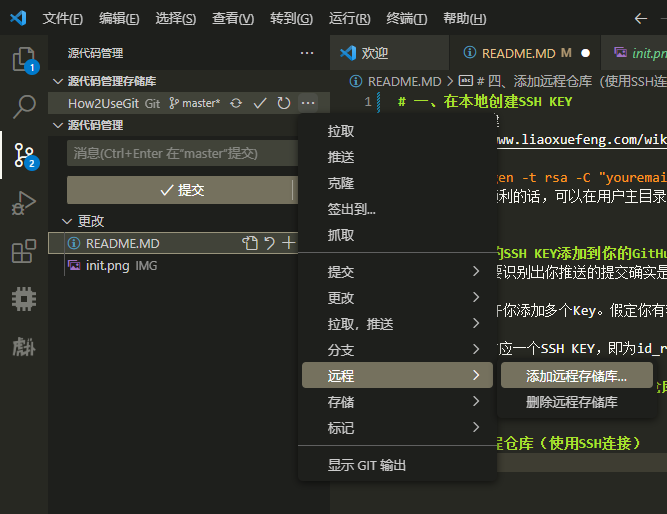
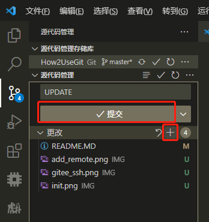

## Git 

[Download Git](https://git-scm.com/downloads)

[Git教程 - 廖雪峰](https://www.liaoxuefeng.com/wiki/896043488029600)

### 一、Git工作方式

    Git         分布式版本控制器
    ---------------------------------------
    workspace   工作区
    index       暂存区
    repository  本地仓库
    remote      远程仓库

    2023/07开始学习

### 二、Git使用流程（Git Bash）

- 1.为主机创建SSH Key（若主机存在SSH Key 则跳过）

    使用Git Bash为主机创建SSH Key

    Bash命令： `ssh-keygen -t rsa -C "youremail@example.com"`

    如果一切顺利的话，**可以在用户主目录里找到.ssh目录**，里面有id_rsa和id_rsa.pub两个文件，这两个就是SSH Key的秘钥对，id_rsa是私钥，不能泄露出去，id_rsa.pub是公钥，可以放心地告诉任何人。

- 2.将此主机的SSH KEY添加到你的GitHub/Gitee账号（若已经添加 则跳过）
  
    GitHub需要识别出你推送的提交确实是你推送的，而不是别人冒充的，而Git支持SSH协议，所以，GitHub只要知道了你的公钥，就可以确认只有你自己才能推送.

    GitHub允许你添加多个Key。假定你有若干电脑，你一会儿在公司提交，一会儿在家里提交，只要把每台电脑的Key都添加到GitHub，就可以在每台电脑上往GitHub推送了。

    *每台主机对应一个SSH KEY，即为`id_rsa.pub`文件的内容。*

- 3.推送push/拉取pull

    1.初始化本地文件夹为Git仓库（若本地文件夹不是Git仓库时）`git init`

    2.为本地仓库添加关联的远程仓库 `git remote add <name> <ssh>`

    若首次SSH连接远程，可能由于没有.ssh/know_hosts
    git bash 会显示无法建立连接,vscode 显示"_or具有指纹"并且无法连接
    这时需要打开bash pull一下，并且在提示后输入yes，创建know_hosts即可

- 解决冲突

    1.拉取远程分支，与本地分支合并，再推送

    2.以新分支推送

### 三、Git Bash 常用指令

    -----------------------------------------init
    mkdir <path_name> 创建目录
    cd <path_name> 进入目录
    pwd 查看当前所在路径
    cat <file_name>查看文件
    git init 当前目录初始化为本地git仓库
    -----------------------------------------add&commit
    git add <filename> 加入暂存区
    git commit -m <commit> 提交至本地仓库
    可以add多次多个文件，一次commit
    -----------------------------------------remote
    git remote -v 查看本地仓库远程库信息
    git remote rm <name> 删除关联远程库
    git remote add <name> <ssh> 链接关联远程库
    (直接add <name> <http url>会导致要填写credential...)
    git pull <name> master 拉取远程仓库
    git push <name> master 推送master
    git clone <repo_http> 克隆远程仓库

### 四、使用VScode管理Git

[VScode](https://code.visualstudio.com/)

注意：您需要确认已经将使用主机的SSH KEY添加到 GitHub/Gitee账号

1. 将本地项目文件夹初始化为Git仓库

    

2. 添加远程仓库（使用SSH URL）

    

    输入github/gitee的SSH连接，并且为远程仓库命名

3. 暂存并且提交本地，发布至远程仓库的主线/分支

    

    提交成功后，就可以同步至远程啦！

4. 系统右键使用VScode快捷打开文件夹

    不论 已安装/未安装VScode 都可以通过软件包加入功能，不会导致重装VScode配置环境变化

    

## VScode

### 一、VScode安装与配置

[VScode](https://code.visualstudio.com/)

需要注意勾选右键管理功能，其他无需特别注意（忘记勾选也可以使用安装包重新勾选）

### 二、VScode扩展

#### Python开发插件

- 1.下载并且安装python，引入python环境变量

- 2.cmd测试python，vscode加载python插件

#### C/C++开发插件

[VScode for C/C++](https://code.visualstudio.com/docs/languages/cpp)

[MSYS2](https://www.msys2.org/)

- C/C++扩展：支持开发C/C++

- MSYS2（非插件）：提供MinGW（Minimalist GNU for Windows）

    在系统变量的path添加你的\mingw64\bin路径

    成功后可以在cmd使用指令测试环境是否添加，然后快乐编程C/C++

        gcc --version
        g++ --version
        gdb --version

#### MCU开发插件

- Embedded IDE：嵌入式开发插件

    [Embedded 论坛](https://discuss.em-ide.com/)

- Cortex-Debug：调试插件

    [CORTEX-DEBUG 用法](https://discuss.em-ide.com/blog/67-cortex-debug)

    Cortex-debug 扩展配置：

    1.配置 GBD 目录的路径
    查找你的 arm-none-eabi-gdb.exe 位置。
    如果没有，可以在ARM下载，或者EIDE-安装实用工具-GNU Arm Embedded Toolchain(stable)，引入bin目录即可。

    2.配置 GDBServer 目录路径
    查找你的 JLinkGDBServerCL.exe 位置
    如果没有，可以在Jlink下载，或者EIDE-安装实用工具-JLink，需要将exe路径引入

    3.配合EIDE，配置烧录器选项，生成elf，即可进入调试。

## Markdown

[MarkDown官方文档](https://markdown.com.cn/)

*Markdown 是一种轻量级标记语言，创始人为约翰·格鲁伯（John Gruber）。 它允许人们使用易读易写的纯文本格式编写文档，然后转换成有效的 XHTML（或者HTML）文档。这种语言吸收了很多在电子邮件中已有的纯文本标记的特性。*

MarkDown文件形式：`file.md`
