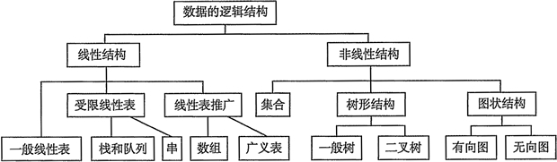

$$
绪论
\begin{cases}
    数据结构（三要素）
    \begin{cases}
        逻辑结构\begin{cases}线性结构\\非线性结构\end{cases}\\存储结构\\数据的运算
    \end{cases}\\
    五个特征
    \begin{cases}
        算法定义\\五个特性\\效率的度量\begin{cases}时间复杂度\\空间复杂度\end{cases}
    \end{cases}\\
\end{cases}\\
$$

## 1.1 数据结构基本概念

### 1.1.1 数据结构基本概念

- 数据：在计算机科学中，数据是所有能输入计算机并被计算机程序处理的符号的介质的总称，是用于输入计算机进行处理，具有一定意义的数字、字母、符号和模拟量等的通称。

- 数据元素：数据的基本单位，通常作为一个整体进行考虑和处理。一个数据元素由若干数据项组成，数据项是构成数据元素最小的不可分割单位。
  
    ```c
    //例如，该“学生”数据元素。由学号，名字，性别数据项组成
    typedef struct{
        uint8_t[20] number;
        uint8_t[20] name;
        uint8_t[10] gender;
    }student
    ```

- 数据结构：数据元素相互之间存在一种或多种特定关系，这种数据元素相互之间的关系称为结构。数据的逻辑结构和存储结构是密不可分的，一个算法的设计取决于选定的逻辑结构，而算法的实现依赖于采用的存储结构

### 1.1.2 数据结构三要素

!!! note

    数据结构三要素：逻辑结构，存储结构，数据的运算。

    逻辑结构：指数据元素间的逻辑关系。
    
    存储结构：指数据结构在计算机中的映像。

- 数据的逻辑结构：逻辑结构与存储无关，独立于计算机。数据的逻辑结构分为线性结构与非线性结构。

    

- 数据的存储结构：指数据结构在计算机中的表示（映像），也称物理结构。数据的存储结构主要有顺序存储、链式存储、索引存储和散列存储。

    1.顺序存储：把逻辑上相邻的元素存储在物理位置也相邻的存储单元中，元素之间的关系由存储单元的邻接关系来体现。
    ——（优点是可以随机存取，且每个元素占用最小的存储空间；缺点是只能用一整块存储单元来存储，容易产生存储碎片）

    2.链式存储：不要求逻辑上相邻的元素在物理位置上也相邻，借助指示元素存储地址的指针来表示元素之间的逻辑关系。
    ——（优点是不会产生碎片现象，能充分利用所有的存储单元；缺点是每个元素因为存储指针而占用额外的存储空间，且只能按顺序存取）

    3.索引存储：在存储元素信息的同时，还建立附加的索引表。索引表中的每项称为索引项。索引项的的一般形式是（关键字，地址）。
    ——（优点是检索速度快；缺点是附加的索引表额外占用存储空间【空间换时间】，另外，增加和删除数据时也要修改索引表，会花费较多时间）

    4.散列存储：根据元素的关键字直接计算出该元素的存储地址。又称哈希Hash存储。——（优点是检索，增加和删除结点的操作都很快；缺点是若散列函数不好，则可能出现元素存储单元的冲突，而解决冲突会增加时间和空间的开销）

## 1.2 算法和算法评价

### 1.2.1 算法基本概念

- 算法五个特性：输入，输出，有穷性，确定性，可行性

- 好算法应具备：正确性，可读性，健壮性，高效性与低存储。

### 1.2.2 算法效率的度量

- 时间复杂度

- 空间复杂度

    算法原地工作是指算法所需的辅助空间为常量，即O(1)