## 一、计算机系统概述

- 操作系统特征：

  - （基本）1并发：两个或多个事件在同一时间间隔内发生，注意并发不是并行
  - （基本）2共享：系统的资源可供多个并发执行的进程使用
  - 3虚拟
  - 4异步

- 目标和功能

  - 计算机系统资源的管理者

    1处理机管理：（处理机分配和运行都以进程为基本单位，可以归结为对进程的管理）进程管理包括 进程控制、进程同步、进程通信、死锁处理、处理机调度等。

    2存储器管理：内存分配与回收、地址映射、内存保护与共享、内存扩充等

    3文件管理：文件存储空间的管理、目录管理、文件读写管理和保护等

    4设备管理：缓冲管理、设备分配、设备处理、虚拟设备等

  - 用户与计算机系统之间的接口

    1命令接口：交互式命令接口、批处理命令接口

    2程序接口：由系统调用组成，GUI如图像接口

- 发展

  - 1手工操作阶段
  - 2批处理操作系统（单道，多道）
  - 3分时操作系统（时间片轮转）
  - 4实时操作系统
  - 5网络和分布式操作系统
  - 6个人操作系统

- 操作系统运行环境

  - 1操作系统运行机制

        时钟管理
        中断机制
        原语
        系统控制的数据结构和处理PCB

  - 2中断和异常

        切换用户态和核心态，当用户进程调用系统调用时，从用户态进入内核态。
        1中断的异常和定义
        2中断处理的过程

  - 3系统调用

        系统调用大致分类
        1设备管理 设备的请求或释放，设备的启动等
        2文件管理 文件的读写，创建，删除等
        3进程控制 进程的创建，撤销，删除等
        4进程通信 进程之间的消息传递或信号传递等功能
        5内存管理 内存的分配，回收以及获取作业占用内存大小等

- 小记

    1并行性和并发性：

        并行：多核运行多任务，指两个或者多个事件在同一时刻发生（微观）
        并发：单核时间片轮转运行多任务，指两个或多个时间在同一时间片段发生（宏观）

    2特权指令与非特权指令

        核心态：特权指令与非特权指令。
        用户态：非特权指令

## 二、进程管理（重点）

### 进程

- 概念：与程序的区别

    为了使参与并发执行的程序能独立运行，必须为之配置一个专门的数据结构，称之为进程控制块（ProcessControlBlock）。系统利用PCB来描述进程的基本情况和运行状态，进而控制和管理进程。_PCB是进程存在的唯一标志_。

        1进程是程序的一次执行过程
        2进程是一个程序及其数据在处理机上顺序执行所发生的活动
        3进程是具有独立功能的程序在一个数据集合上运行的过程，是系统资源分配和调度的一个独立单位。

- 特征：动态性、并发性、独立性、异步性、结构性（理解即可）

- 状态：运行态、就绪态、阻塞态、结束态、创建态

        1运行态：进程在CPU上运行
        2就绪态：进程获得了除CPU外的一切资源，得到CPU资源后即可运行。
        3阻塞态：进程正在等待某一事件而暂停运行
        4结束态：进程从系统中消失。
        5创建态：进程正在被创建，尚未转到就绪态。

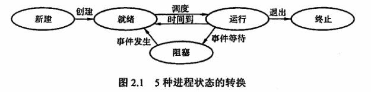

- 控制：创建、终止、阻塞和唤醒、切换

- 组织：进程控制块PCB、程序段、数据段

- 通信：共享存储、消息传递、管道通信

### 线程

- 概念、与进程的区别

    传统操作系统中，拥有资源和独立调度的基本单元是进程。在引入线程的操作系统中，线程是独立调度的基本单位

- 线程的实现方式

### _处理机调度（重点调度算法）_

- 概念、三级调度：作业调度、中级调度、进程调度

- 调度方式：剥夺式、非剥夺式

        非剥夺调度（非抢占方式），当一个进程正在处理机上执行时，即使有某个更为重要或紧迫的进程进入就绪队列，仍然让正在执行的进程继续执行，直到该进程完成或其他因素进入阻塞态，才能把处理机分配给更重要或紧迫的进程

        剥夺调度（抢占方式）。指当一个进程在处理机上执行时，若有某个更重要或紧迫的进程需要使用处理机，则立即停止正在执行的进程，将处理机分配给更重要或紧迫的进程

- 调度准则：CPU利用率、吞吐量、周转时间、等待时间、响应时间

        周转时间 = 作业完成时间-作业提交时间

        平均周转时间 =（作业1周转时间+...+作业n周转时间）/n

        带权周转时间 = 作业周转时间/作业实际运行时间

- 算法：先来先服务、短作业优先、优先级、高响应比优先、时间片轮转、多级反馈队列

  - 先来先服务（FCFS）调度算法：每次从就绪队列选择最先进入该队列的进程，将处理机分配给它

  - 短作业优先（SJF）调度算法：短专业SJF从后备队列中选择一个或若干估计运行时间最短的作业，将它们调入内存运行，短进程SPF从就绪队列中选择一个估计运行时间最短的进程，将处理机分配给它，使之立即执行。

  - 优先级调度算法：每次从后备队列中选择优先级最高的一个或几个作业，将它们调入内存，分配必要的资源，创建进程并放入就绪队列。进程调度中，优先级调度算法每次从就绪队列中选择优先级最高的进程，将处理机分配给它，使其投入运行。根据是否可抢占任务，分为：非剥夺式优先级调度算法，剥夺式优先级调度算法。根据进程创建后优先级是否可以改变，分为：静态优先级，动态优先级

  - 高响应比优先级调度算法：每次作业调度时，先计算后备作业队列中每个作业的响应比，从中选出响应比最高的作业投入运行

  - 时间片轮转调度算法：时间片的大小对系统性能影响很大。若时间片足够大，以至于所有进程都能在一个时间片内执行完毕，则时间片轮转调度算法退化为先来先服务调度。若时间片很小，则处理机在进程间过于频繁地切换，使处理机的开销增大，而真正用于运行用户进程的时间减少。

  - 多级反馈队列调度算法：该算法是时间片轮转调度算法和优先级调度算法的综合与发展。

### _进程同步_

- 概念：临界资源、同步、互斥

  - 临界资源：一次仅允许一个进程使用的资源

  - 同步：指为完成某种任务而建立的两个或多个进程，这些进程因为需要某些位置上协调他们的工作次序而等待、传递信息所产生的制约关系。

  - 互斥：当一个进程进入临界区使用临界资源时，另一个进程必须等待，当占用临界资源的进程退出临界区后，另一进程才允许访问此临界资源。

- 实现方法：软件实现的几种算法、硬件实现

- 信号量：实现同步、互斥、前驱关系图

    信号量机制是一种功能较强的机制，可以用来解决互斥与同步问题，它只能被两个标准的原语wait(S)和signal(S)访问，也可记为“P操作”和“V操作”

  - 信号量实现同步

      ```c
      semaphore S=0; //初始化信号量
      P1(){
            执行动作; 
            V(S); //告诉P2进程，动作执行完成
            ...
      }
      P2(){
            ...
            P(S); //检查动作是否执行完成
            执行动作;
            ...
      }
      ```

  - 信号量实现互斥

      ```c
      semaphore S=1; //初始化信号量
      P1(){
            ···
            P(S); //准备开始访问临界资源，加锁
            进程P1的临界区；
            V(S); //访问结束，解锁
            ...
      }
      P2(){
          ···
          P(S); //准备开始访问临界资源，加锁
          进程P2的临界区；
          V(S); //访问结束，解锁
          ...
      }
      ```

  - 实现前驱关系图

      如图给出一个前驱图，为保证S1-S2,S1-S3前驱关系，分别设置信号量a1，a2。为保证S2-S4，S2-S5前驱关系，分别设置信号量b1，b2。保证S3-S6，设置信号量c。保证S4-S6，设置信号量d。保证S5-S6，设置信号量e

      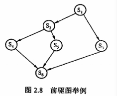

      ```c
      semaphore a1=a2=b1=b2=c=d=e=0; //初始化信号量

      S1(){
            ...；
            V(a1);
            V(a2);//S1已经运行完成
      }

      S2(){
            P(a1);//检查S1是否运行完成
            ...；
            V(b1);
            V(b2);//S2已经运行完成
      }

      S3(){
            P(a2);//检查S1是否运行完成
            ...;
            V(c);//S3已经运行完成
      }

      S4(){
            P(b1);//检查S2是否运行完成
            ...;
            V(d);//S4已经运行完成
      }

      S5(){
            P(b2); //检查S2是否运行完成
            ...;
            V(e);//S5已经运行完成
      }

      S6(){
            P(c);//检查S3是否运行完成
            P(d);//检查S4是否运行完成
            P(e);//检查S5是否运行完成
            ..;
      }
      ```

- 经典问题：生产者消费者、读者写者、哲学家进餐、吸烟者

  - 生产者-消费者问题

      一组生产者进程和一组消费者进程共享一个初始为空、大小为n的缓冲区，只有缓冲区不满时，生产者才能把消息放入缓存区，否则必须等待；只有缓冲区不空时，消费者才能从中取出消息，否则必须等待。缓冲区是临界资源，只允许一个生产者放入消息，或一个消费者取出消息。

      ```c
      semaphore mutex = 1;//临界区互斥信号量
      semaphore empty = n;//空闲缓冲区
      semaphore full = 0;//缓冲区初始化为空

      producer(){
          while(1){
                生产数据;
                P(empty); //获取空缓冲区单元
                P(mutex); //进入临界区
                放入数据；
                V(mutex); //离开临界区，释放互斥信号量
                V(full); //满缓冲区数加1
          }
      }

      consumer(){
          while(1){
                P(full); //获取满缓冲区单元
                P(mutex); //进入临界区
                取出数据；
                V(mutex); //离开临界区，释放互斥信号量
                V(empty); //空缓冲区数+1
                消费数据；
          }
      }
      ```

  - 读者-写者问题

      读者和写者两组并发进程，共享一个文件，当两个或以上的读进程同时访问共享数据时不会产生副作用，但若某个写进程和其他进程同时访问共享数据时则可能导致数据不一致错误。所以要求：1允许多个读者可以同时对文件执行读操作 2只允许一个写者往文件中写信息 3任一写者在完成写操作之前不允许其他读者或写者工作 4写者写操作前，应让已有的读者和写者全部退出

      ```c
      int count=0;//用于记录当前的读者数量
      semaphore mutex=1;//用于保护更新count变量时的互斥
      semaphore rw=1;//用于保护读者和写者互斥地访问文件
      writer(){
          while(1){
                P(rw);//互斥访问共享文件
                写入;
                V(rw);//释放共享文件
          }
      }

      reader(){
          while(1){
                P(mutex);//互斥访问count变量
                if(count==0)//当第一个读进程读共享文件时
                    P(rw);//阻止写进程
                count++;//读者计数器加1
                V(mutex);//释放互斥变量count
                读取;
                P(mutex);//互斥访问count变量
                count--;
                if(count==0)//当最后一个读进程读完共享文件
                    V(rw);//允许写进程写
                V(mutex);//释放互斥变量count
          }
      }
      ```

  - 哲学家进餐问题（待补充）

  - 吸烟者问题（待补充）

### _死锁_

- 定义

    多进程并发，改善了系统资源的利用率并且提高了系统的处理能力，然而，多个进程的并发执行也会带来问题——死锁，指的是多个进程因为竞争资源而造成的一种僵局（相互等待）

- 原因：系统资源竞争、进程推进顺序非法

- 条件（同时满足4个条件才能产生死锁）：互斥、不剥夺、请求和保持、循环等待

- 策略：预防死锁、避免死锁、死锁的检测与解除

  - 预防死锁（只需破坏死锁产生的4个必要条件之一即可）
  
        1破坏互斥条件

        2破坏不剥夺条件

        3破坏请求保持条件

        4破坏循环等待条件

  - 避免死锁

    1系统安全状态：在系统进行资源分配之前，先计算此次分配的安全性

        列出最大需求矩阵Max，分配矩阵Allocation
        需求矩阵 Need=Max-Allocation
        现存资源向量Work

        一、初始时安全序列为空。
        二、从need矩阵中找出符合下面条件的行向量：该行向量对应的进程不在安全序列中，且该行小于等于Work向量，找到后，把对应的进程加入安全序列，若找不到，则执行步骤四。
        三、进程Pi进入安全序列后，可顺利执行，直到完成，并且释放被分配的资源，work=work+allocation[i]，其中allocation[i]表示进程Pi代表的在allocation矩阵中对应的行，返回步骤二。
        四、若此时安全序列中已有所有进程，则系统处于安全状态，否则系统处于不安全状态。

    2银行家算法（最著名的死锁避免算法）：顾名思义，把操作系统视作银行家，操作系统管理的资源相当于银行家管理的资金，进程向操作系统请求资源相当于用户向银行贷款。

        Requesti是进程Pi的请求向量，Requesti[j]=K表示进程Pi需要j类资源K个。当Pi发出资源请求后，系统按照下述步骤进行检查：

        一、Requesti[j]<=Need[i,j]，则转向步骤2；否则认为出错。因为所需要的资源数超出它所宣布的最大值
        二、若Requesti[j]<=available[j]，则转向步骤3；否则表示尚无足够资源，Pi需等待
        三、系统试探着把资源分配给进程Pi，并且修改下面数据结构中的数值
            available=available-requesti；
            allocation[i,j]=allocation[i,j]+requesti[j];
            need[i,j]=need[i,j]-requesti[j]
        四、执行安全性算法，检查此次资源分配后，系统是否处于安全状态。若安全，才正式将资源分配给进程Pi，完成本次分配；否则让进程Pi等待

  - 死锁的检测与解除

## 三、存储器管理（重点、复杂）

### 程序执行过程

- 编译、链接、装入

    链接：静态链接、装入时动态链接、运行时动态链接

    装入：绝对装入、可重定位装入、动态运行时装入

- 逻辑地址和物理地址

    物理地址空间是指内存中物理单元的集合，它是地址转换的最终地址、，进程在运行时执行指令和访问数据，最后都要通过物理地址从主存中存取。当装入程序将可执行代码装入内存时，必须通过地址转换将逻辑地址转为物理地址，这个过程称为重定位

- 内存保护

    内存分配前。需要保护操作系统不受用户进程的影响，同时保护用户进程不受其他用户进程影响，可以采取两种内存保护方法：

    1在CPU中设置一对上、下限寄存器，存放用户作业在主存中的下限和上限地址

    2采用重定位寄存器（基地址寄存器）和界地址寄存器（限长寄存器）来实现保护。

### 连续分配

- 单一连续分配

    此方式下内存分为系统区和用户区，系统区仅用操作系统使用，通常在地地址部分；用户区是为用户提供的、除系统区之外的内存空间。该方式无需保护内存。因为内存中永远只有一道程序，不会受到访问越界而干扰其他程序。

- 固定分区分配（内存碎片）

    最简单的多道程序存储管理方式，它将用户内存空间划分为若干固定大小的区域，每个分区只装入一道作业。固定分区分配在划分分区时有两种不同方法。1分区大小相等，2分区大小不等。当程序小于固定分区大小时，也占用一个完整的内存分区空间，这样分区内部就存在空间浪费，称之为内部碎片。

- 动态分区分配

    又称为可变分区分配，是一种动态划分内存的分区方法。这种分区方法不预先划分内存，而是在进程装入内存时，根据进程的大小动态地建立分区，并使分区大小正好适合进程的需要。

    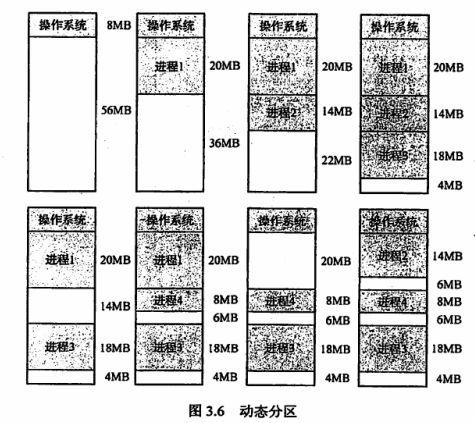

  - 外部碎片
  
    动态内存分区在开始分配时是很好的，但之后会导致内存中出现许多小的内存块，随着时间推移，内存中会产生越来越多的碎片，内存的利用率随之下降，这些小的内存块称为外部碎片。

  - 分配算法：首次、最佳、最坏、邻近适应

    进程装入或换入主存时，若内存中有多个足够大的空闲块，则操作系统必须确定分配哪个内存块给进程使用，这就是动态分区的分配策略。考虑以下几种算法：

    1首次适应算法：空闲分区以地址递增的次序链接。分配内存时顺序查找，找到大小能满足要求的第一个空闲分区

    2最佳适应算法：空闲分区按照容量递增的方式形成分区链，找到第一个能满足要求的空闲分区

    3最坏适应算法：空闲分区以容量递减的次序链接，找到第一个能满足要求的空闲分区

    4邻近适应算法：由首次适应算法演变而成，不同之处是，分配内存时从上次查找结束的位置开始继续查找

### 非连续分配

非连续分配允许一个程序分散地装入不相邻的内存分区。在连续内存分配管理中，即使内存有超过1GB的空闲空间，但若没有连续的1GB内存空间。则需要1GB空间的作业仍然是无法运行的；但若采用非连续分配管理的方式，则作业所需要的1GB内存空间可以分散地分配在内存的各个区域。

根据分区大小是否固定，分为分页存储管理方式和分段存储管理方式。
而分页存储管理方式又分为1基本分页存储管理方式 2请求分页存储管理方式

- 页式存储管理

  - 概念：页面、地址结构、页表

    页面和页面大小：进程中的块称为页Page，内存中的块称为页框Page Frame。外存也以同样的单位进行划分，直接称为块。进程在执行时需要申请主存空间，即要为每个页面分配主存中的可用页框

  - 地址变化机构及变化过程（重点）

    地址结构包含两个部分：前部分为页号P，后部分为业内偏移量W

    页表：为了便于内存中找到进程的每个页面对应的物理块，系统为每一个进程建立一张页表，它记录页面在内存中对应的物理块号，页表一般存放在内存中。

    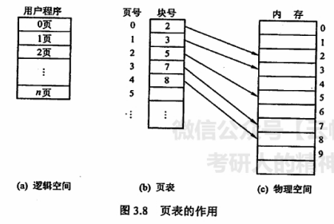

    地址变换过程是由硬件自动完成的。例如，页面大小L为1KB，页号2对应的物理块为b=8，计算逻辑地址A=2500对于的物理地址：页号P=2500/1K=2，页内偏移量W=2500%1K=452，查得页号2对应的物理块号为8，物理地址E=8*1024+452=8644

    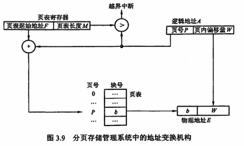

    （物理地址=页号得到块号*页面大小+页内偏移量）

  - 快表（重点）

      在地址变换过程中，若页表全部存放在内存中，则存取一个数据或一条指令至少要访问两次内存。一次是访问页表，确定所存取的数据或指令的物理地址；另一次是根据地址存取数据或指令。

      为了解决访问内存造成的速度减慢，在地址变换机构中增加一个具有并行查找能力的高速缓冲存储器————块表，用来存放当前访问的若干页表项，以加速地址变换的过程。与此对应的主存中的页表称为慢表

      1. CPU给出逻辑地址后，由硬件进行地址转换，将页号送入高速缓存寄存器，并且将此页号与快表中的页号进行比较。

      2. 若找到匹配的页号，说明所要访问的页表项在快表中，则直接从中取出该页对应的页框号，与页内偏移量拼接形成物理地址。这样存取数据一次访存便可实现

      3. 若未找到匹配的页号，则需要访问主存中的页表，在读出页表项后，应同时将其存入快表，以便后面可能的再次访问。

      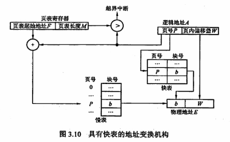

      （块表代替主存中的慢表）

      （但若快表已满，则必须按照一定的算法对旧的页表项进行替换。）

  - 两级页表

      由于引入了分页管理，进程在执行时不需要将所有页调入内存页框，而只需将保持有映射关系的页表调入内存。但是，我们仍然需要考虑页表的大小。

      以32位逻辑地址空间、页面大小4KB、页表项大小4B为例，若要实现进程对全部逻辑地址空间的映射，则每个进程需要2^20即约100万个页表项。也就是说每个进程仅页表这一项就需要4MB主存空间，显然不切实际。

      为了压缩页表，我们进一步延伸页表映射的思想，就可以得到二级分页，既使用层次结构的页表；

      建立多级页表的目的在于建立索引，以便不用浪费主存空间去存储无用的页表项，也不要盲目地顺序式查找页表项

- 段式存储管理

  分页式管理是从计算机的角度考虑设计的，目的是提高内存的利用率，提高计算机的性能。分页通过硬件机制实现，对用户完全透明。分段管理方式的提出则考虑了用户和程序员，以满足方便编程、信息保护和共享、动态增长及动态链接等多方面的需要

  - 段表、地址变换机构、段的共享与保护

      分段：段式管理方式按照用户进程中的自然段划分逻辑空间。

      段表：每个进程都有一张逻辑空间与内存空间映射的段表，其中每个段表项对应进程的一段，段表项记录该段在内存中的始址和长度。

      地址变换机构：

      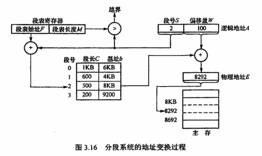

      （物理地址=段号得到基址+偏移量）

- 段页式存储管理(段表、页表)

  页式存储管理能有效地提高内存利用率，分段存储管理能反应程序的逻辑结构并有利于段的共享。将这两种存储管理方法结合起来，便形成了段页式存储管理方法。

  段页式系统中，作业的地址空间首先被分成若干逻辑段，每个段都有自己的段号，然后将每个段分成若干大小固定的页。对内存空间的管理仍然和分页存储管理一样，将其分成若干和页面大小相同的存储块，对内存的分配以存储块单位。

  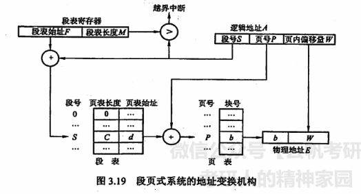

  （物理地址=（段表查得页表始地址->页表查到块号）*页面大小+页内偏移量）

### _虚拟内存（重点页面置换算法）_

- 概念

  传统存储管理方式的特征: 1一次性 2驻留性

  - 局部性原理：时间局部性，空间局部性

  - 特征：多次性、对换性、虚拟性

- 请求分页

  请求分页系统建立在基本分页系统基础之上，为了支持虚拟存储器功能而增加了请求调页功能和页面置换功能。请求分页是目前最常用的一种实现虚拟存储器的方法。

  在请求分页系统中，只要求需要的一部分页面装入内存，便可以启动作业运行。作业执行过程中，当需要访问的页面不在内存中时，再通过调页功能将其调入，同时还可以通过置换功能将暂时不用的页面换出到外存上，以腾出空间。

  实现请求分页，系统必须提供一定的硬件支持。除了需要一定容量的内存和外存，还需要有页表机制、缺页中断机构和地址变换机构

  - 组成：页表机构、缺页中断机构、地址变换机构

  - 页面置换算法：决定换入哪页、换出哪页

    - 最佳置换OPT：淘汰以后永久不使用，或最长时间内不再被访问的页面。

    - 先进先出FIFO：优先淘汰最早进入内存的页面，即在内存中驻留最久的页面。

    - 最近最久未使用LRU：选择最近最长时间未访问过的页面进行淘汰。

    - 时钟CLOCK算法：算法循环扫描缓冲区，像时钟指针一样转动，故称为CLOCK算法。

        1. (u=0,m=0,最近未被访问，也未被修改)
        2. (u=1,m=0,最近被访问，但未被修改)
        3. (u=0,m=1，最近未被访问，但被修改)
        4. （u=1,m=1，最近被访问，被修改）

        1被替换的优先级最高，如果不存在1，则向下寻找00->10->01->11

  - 页面分配策略：预调页策略、请求调页策略

  - 抖动、工作集

## 四、文件管理

### 概念——定义、属性、基本操作、打开与关闭

定义：1数据项（原子数据）2记录（相关的数据项的集合） 3文件（相关信息集合）

属性：名称、标识符、类型、位置、大小、保护、时间

基本操作：创建、写、读、文件重定位、删除、截断

打开与关闭：

### 文件逻辑结构

- 无结构文件（流式文件）

    数据按顺序组织成记录并累积、保存，以字节为单位。无结构文件没有结构，因而对记录的访问只能通过穷举方式，所以这种文件形式大多数应用不适用。对于基本信息单位操作不多的文件较适合采用字符流的无结构方式，如源程序文件、目标代码文件等等

- 有结构文件（记录式文件）

    1. 顺序文件：记录通常是定长的，可以顺序存储或以链表形式存储，访问时需要顺序搜索文件。

    2. 索引文件

    3. 索引顺序文件

    4. 直接文件或散列文件

### 目录结构

- 文件控制块、索引结点

    文件控制块FCB：是用来存放控制文件需要的各种信息的数据结构。

    索引结点：文件描述信息单独形成一个称为索引结点的数据结构

- 单级目录结构、两级目录结构、树形目录结构、图形目录结构

### 文件共享

- 基于索引结点（硬连接）

- 基于符号链实现（软连接）

- 文件保护——访问类型、访问控制

    访问类型：读、写、执行、添加、删除、列表清单

    访问控制（用户类型）：1拥有者 2组 3其他用户

### 实现

- 层次结构

    1. 用户调用接口（0级，面向用户）
    2. 文件目录系统
    3. 存取控制验证模块
    4. 逻辑文件系统与文件信息缓冲区
    5. 物理文件系统
    6. 辅助分配模块
    7. 设备管理程序模块

- 目录实现

    1. 线性列表
    2. 哈希表

- 文件分配

    1. 连续分配
    2. 链接分配
    3. 索引分配

- 文件存储空间管理

    1. 空闲表法
    2. 空闲链表法
    3. 位示图法
    4. 成组链接法

### _磁盘（重点磁盘调度算法）_

- 访问时间

    总平均存取时间Ta=寻找时间+旋转延迟时间+传输时间

    寻找时间=m（磁盘驱动器速度相关常熟）*n（跨越n跳磁道）+s（启动磁臂时间）

    旋转延迟时间=1/2r（r旋转速度）

    传输时间=b/rN（b读写字节数，r磁盘每秒转数，N磁道字节数）

- 调度算法（求平均寻找长度）

    1. 先来先服务：按照访问磁盘的先后顺序进行调度

    2. 最短寻找时间优先：每次选择与当前磁头所在磁道距离最近的磁道，使得寻找时间最短

    3. 扫描算法SACN（电梯调度算法）：最短寻找时间优先算法的基础上规定了磁头的运动方向，即在当前移动方向上选择与当前磁头所在磁道最近的请求。和电梯运行相似，因此又称为电梯调度算法

        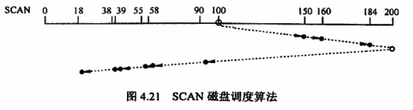

    4. 循环扫描算法C-SCAN:在扫描算法基础上规定磁头单向移动来提供服务，返回时直接快速移动到起始端而不服务任何请求。（移动到起始端可以改进为移动到最远端请求，称呼为LOOK算法）

        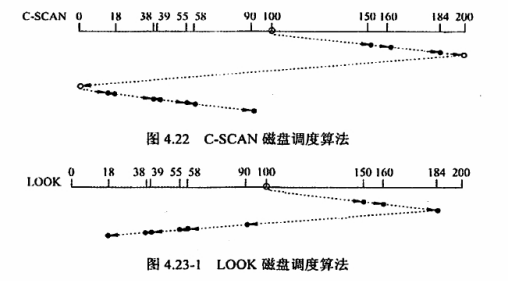

- 磁盘的管理

  - 磁盘初始化

  - 引导块：计算机启动时需要一个初始化程序，它初始化CPU，寄存器，设备控制器和内存等，接着启动操作系统。因此，初始化程序应该找到磁盘上的操作系统内核，装入内存，并且转到起始地址，从而开始操作系统的运行

  - 坏块

## 五、设备管理

### 概述

- IO设备分类

    使用特性：人机交互类外用设备、存储设备、网络通信设备

    传输速率：低速设备、中速设备、高速设备

    信息交换单位：块设备、字符设备

- IO控制方式：程序直接控制、中断驱动方式、DMA方式、通道方式

    通道方式要比其他几种方式更加优越，因此现代操作系统的IO控制采用的都是通道控制。

    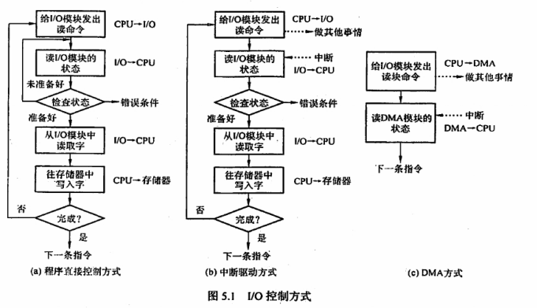

- IO层次结构：用户层IO、设备独立性软件、设备驱动层、中断处理层、硬件层

    0. 参考RTThread分层设计

    1. 用户层IO软件：实现用户交互的接口，用户可直接调用在用户层提供的，与IO操作有关的库函数，对设备进行操作。
    2. 设备独立性软件：实现用户程序与设备驱动器的统一接口、设备命令、设备保护及设备分配与释放等，同时为设备管理和数据传输提供必要的存储空间。（解耦应用层和硬件层）（使得应用程序独立于具体使用的物理设备）
    3. 设备驱动程序：与硬件直接相关，负责具体实现系统对设备发出的操作指令，驱动IO设备工作的驱动程序
    4. 中断处理程序：用于保存被中断进程的CPU环境，转入相应的中断处理程序进行处理，处理完并恢复被中断进程的现场后，返回被中断进程。
    5. 硬件设备

- IO管理实现的功能：1状态跟踪 2设备存取 3设备分配 4设备控制

### 缓冲区

由于IO设备种类繁多，功能和传输速率差异巨大，因此需要多种方法进行设备控制。操作系统开发人员通过为每个设备维护一个请求队列来实现调度。当应用程序执行阻塞IO系统调用时，该请求就加到相应的设备队列上。4章中的磁盘调度算法其实就是IO调度的一种

引入缓冲区的目的主要如下：

1. 缓和CPU和IO设备间速度不匹配的矛盾
2. 减少对CPU的中断频率，放宽对CPU中断响应时间的限制
3. 解决基本基本数据单元大小不匹配的问题
4. 提高CPU与IO设备之间的并行性

实现缓冲区的方法如下：

1. 采用硬件缓冲器，但有一点成本，除了关键部位，一般不采用硬件缓冲器
2. 采用位于内存区域的缓冲区

块设备输入时，假定从磁盘把一块数据输入缓冲区的时间为T，操作系统将该缓冲区中的数据传送到用户区的时间为M，CPU对这块数据处理的时间为C。

- 单缓冲：设备和处理机之间设置一个缓冲区。设备和处理机交换数据时，先把被交换的数据写入缓冲区，然后需要数据的设备从处理机或缓冲区取出数据

    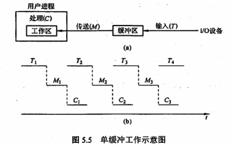

- 双缓冲：根据单缓冲的特点，CPU在传送时间M内处于空闲状态，由此引入双缓冲。IO设备输入数据时先装填到缓冲区1，在缓冲区1填满后才开始填装缓冲区2，与此同时处理机可以从缓冲区1中取出数据放入用户进程处理，当缓冲区1中的数据处理完后，若缓冲区2已填满，则处理机又从缓冲区2中取出数据放入用户进程处理，而IO设备又可以装填缓冲区1。

    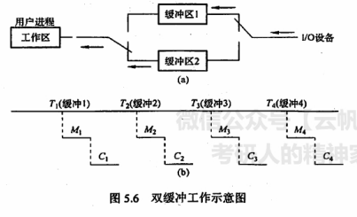

- 循环缓冲：包含多个大小相等的缓冲区，每个缓冲区中有一个链接指针指向下一个缓冲区，最后一个缓冲区指针指向第一个缓冲区，多个缓冲区构成一个环形。

- 缓冲池：由多个系统公用的缓冲区构成。缓冲区按其使用状况可以形成三个队列：空缓冲队列、装满输入数据的缓冲队列（输入队列）、转满输出数据的缓冲队列（输出队列）。还应具有4种缓冲区；用于收容数据的工作缓冲区、用于提取输入数据的工作缓冲区、用于收容输出数据的工作缓冲区以及用于提取输出数据的工作缓冲区

- 缓冲区与高速缓存的对比

    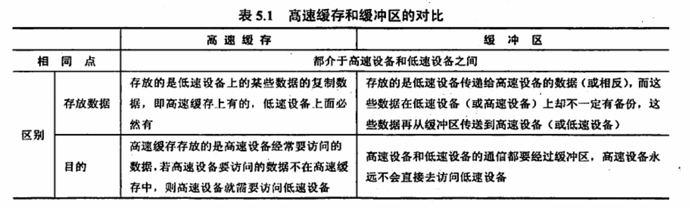

### 设备分配与回收

- 概述

    1. 独占式使用设备：申请设备时，若设备空闲，则将其独占，不允许其他进程申请使用，直到该设备被释放才允许其他进程申请使用。例如打印机

    2. 分时式共享使用设备：独占式使用设备时，设备利用率很低，当设备没有独占使用的要求时，可以通过分时共享使用提高利用率。例如，磁盘对IO操作，各进程的每次IO操作请求可以通过分时来交替进行

    3. 以SPOOLing方式使用外部设备：即假脱机IO技术。这种技术用于对设备的操作，实质上就是对IO操作进行批处理。SPOOLing技术实际是一种空间换时间的技术，而熟悉的请求分页系统中的页面调度算法就刚好相反，是时间换空间的技术。

- 数据结构——DCT、COCT、CHCT、SDT

    DCT：设备控制表

    COCT：控制器控制表

    CHCT：通道控制表

    SDT：系统设备表

    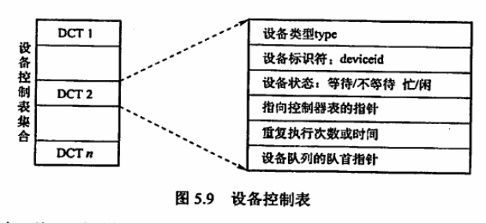

    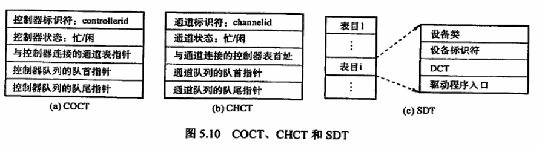

- 策略——静态分配、动态分配

    1. 设备分配原则：总则是既要充分发挥设备的使用效率，又要避免造成进程死锁，还要将用户程序和具体设备隔离

    2. 设备分配方式：

        静态分配：主要用于对独占设备的分配，它在用户作业开始执行前，由系统一次性分配该作业所有要求的全部设备、控制器。一旦分配，这些设备、控制器就一直为该作业所占用，直到该作业被撤销。静态分配方式不会出现死锁，但设备的使用效率低。因此，静态分配方式并不符合分配的总原则

        动态分配：在进程执行过程中，根据执行需要进行。当进程需要设备时，通过系统调用命令向系统提出设备请求，由系统按照事先规定的策略给进程分配所需要的设备、IO控制器，一旦用完，便立即释放。动态分配方式有利于提高设备的利用率，但分配算法使用不当，有可能造成进程死锁

    3. 设备分配算法：先请求先分配、优先级高者优先

- 逻辑设备名到物理设备名的映射

    为了提高设备分配的灵活性和设备的利用率，方便实现IO重定向，引入了设备独立性。设备独立性是指应用程序独立于具体使用的物理设备。
    为了实现设备独立性，在应用程序中使用逻辑设备名来请求使用某类设备，在系统中设置一张逻辑设备表（LUT），用于将逻辑设备名映射为物理设备名。LUT表项包含逻辑设备名、物理设备名和设备驱动程序入口地址；当进程用逻辑设备名来请求分配设备时，系统为它分配相应的物理设备，并在LUT中建立一个表项，以后进程再利用逻辑设备名请求IO操作时，系统通过查找LUT来寻找相应的物理设备和驱动程序。

    系统中可以采取两种方式建立逻辑设备表

### SPOOLing系统

为了缓和CPU的高速性与IO设备低速性之间的矛盾，引入脱机 输入/输出 技术。该技术利用专门的外围控制机，将低速IO设备上的数据传输到高速磁盘上，或者相反。SPOOLing的意思是外部设备同时联机操作，又称家脱机 输入/输出 操作，是操作系统中采用的一项将独占设备改造成共享设备的技术。

1. 输入井和输出井

2. 输入缓冲区和输出缓冲区

3. 输入进程和输出进程
