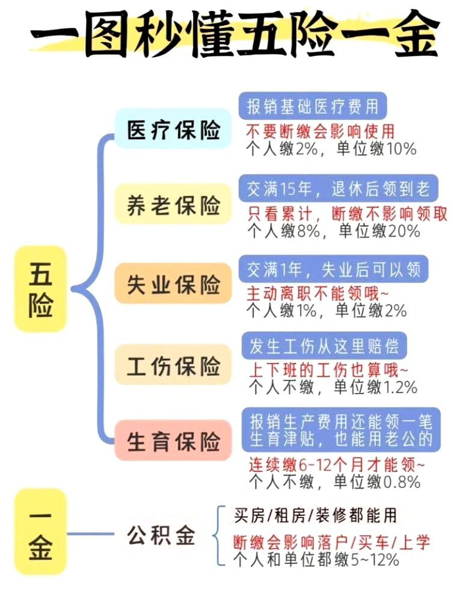

# 求职经验

## 论工作的可持续性

应该具备以下至少一个特点

1. 钱途（真金白银不会错）

2. 前途（平台，技能等等）

3. 时间（宽裕的个人时间）

## 论不被求职市场束缚

- 记住拿多少资源（钱 / 机会）干多少事

    拿命换钱已经不值得了，更何况拿命换不到钱

    一定要存钱，遇到烂公司赶紧跑，别把自己卖了

    否则，你将会失去你有限的生命里的，不可挽回的时间

- 逆水行舟，不进则退

    多在市场验证自己，或者培养与市场直接交易的能力

## 一、找工作

### 投递简历

- HR/面试官是否对面试者保持最基本尊重。
- HR得到简历后，如果要求马上线下面试，这是刷KPI的现象。
- 最好和岗位部门负责人联系后，双方满意，达成一致，再考虑线下面试。

  大家的时间都是时间

### 了解行业

- 同一个岗位，在不同行业区别很大，比如嵌入式工程师，在消费电子和汽车电子里的区别。
每个行业产品特性不同，对于细分岗位也不同，在没有行业经验之前，切记先在网上了解好行业相关岗位

### 询问技术

- 询问公司全局架构，具体产品、具体业务
- 询问面试岗位具体负责产品、业务的什么方面
- 询问岗位部门，具体使用的相关技能

### 公司信息

- 查看公司工商信息，是否有一定规模的参保人数

### 岗位待遇

- 工作时间，是否加班、是否加班费

- 岗位工资，薪资结构、多少薪、年终奖、以及其他补贴

  试用期：试用期时间？试用期工资是否80%

  发工资时间：什么时间发工资，好一点的1，10号，中等的15，20

- 五险一金，是否入职缴纳五险一金

  五险一金与公积金的基数、比例

### 岗位环境

- 租房：价格怎么样，最近通勤位置有多近
- 地理位置：是郊区还是城区，交通怎么样？对个人生活影响比较大

## 二、工作中

只负责直接上级的指派任务

其他非相关外加事物，不用太在意

### 劳动合同

劳动合同一式两份，记得原件一定要拿走!

## 三、离职了

### 解除劳务关系

- 单方面解除：离职通知

  例如以下情况，应当离职通知，而非离职申请

  领导对是否同意你离职不置可否，或者明确拒绝你的离职申请

  与单位存在劳动纠纷，希望获得经济补偿的

- 解除合同：

  若只签订劳动合同，那么试用期3天，正式30天提前告知单位即可离职

  除非签订了培训合同，若说明违约金，在服务期限内离职需要支付违约金

### 离职证明

不管是主动辞职还是裁员辞退，离职证明都必须让公司开具！

没有这份文件，将导致你在社保中心办理业务却无法被受理。

同时入职新公司也需要出具离职证明，用于规避企业用工的法律风险。另外要注意，离职证明一定要改红章！其中包含的员工基本信息、单位名称、离职时间及原因都要具体清晰，但不能出现任何不利于劳动者的信息。

### 解除劳动合同证明

如果想要离职后想要领取失业金过渡一段时间，那么离职时记得让公司给你出局解除劳动合同证明，才能进行失业登记。

这里也要注意，解除劳动合同协议和离职证明不一样离职证明主要提供给第三方办理事务，如入职手续、失业金领取等。

而解除劳动合同协议里的内容，原则上是需要双方保密，不能提供给第三方。

### 工作交接

凡事跟本人挂钩的账号，包括注册过的账号，都需要进行解绑、注销。

如果所注册账号用于公司宣传推广，需要及时跟公司说明清楚，以免因为注销导致公司业务收到影响，从而离职后依然被公司找。

工作中用到个人微信、社交软件、账号等，记得清理聊天记录及相关文件，以及个人账号登录的软件也需要记得从公司电脑退出

## 五险一金

缴纳金额 = 缴纳基数 x 缴纳百分比。（个人+公司）

缴纳额高，个人交的多，公司也交多，缴纳额低，公司交的就少

[个人税计算](http://www.12333si.com/shuihou/gongzi.html)

